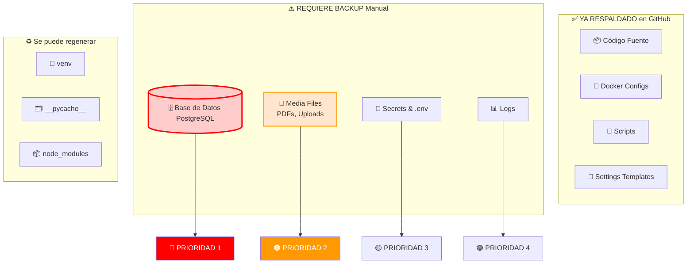
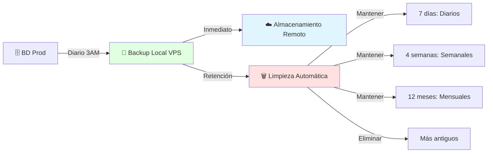
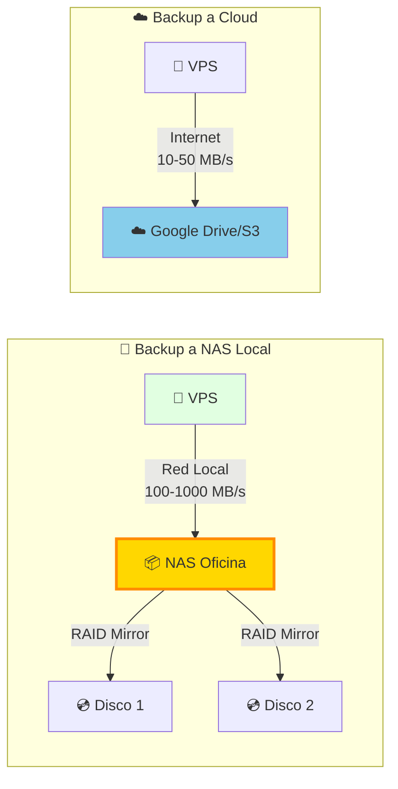
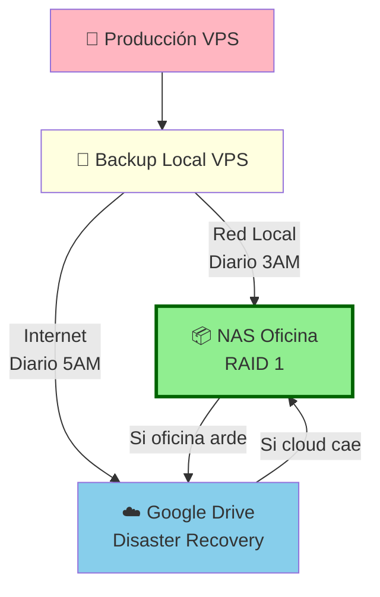
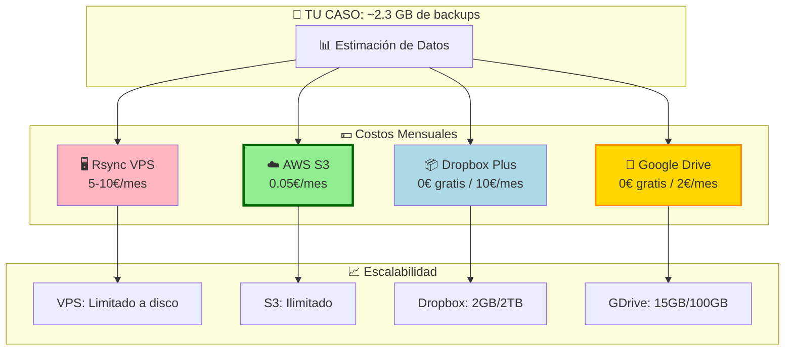
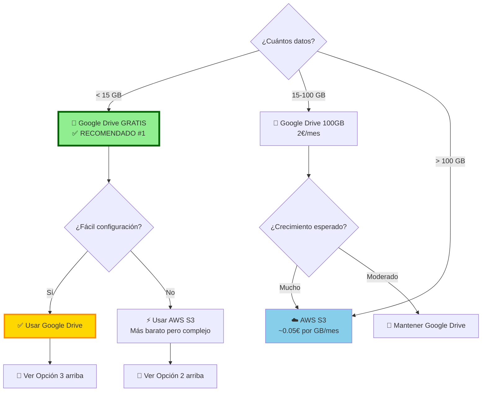
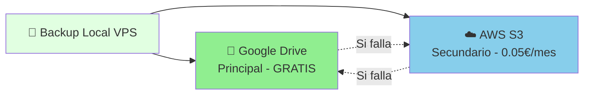
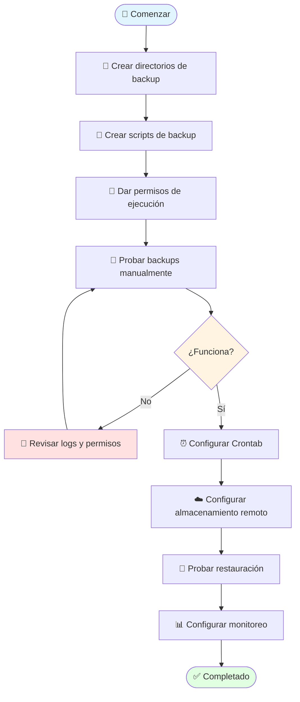

# 💾 Estrategia de Backup - Ecodisseny VPS

## 📋 Índice

- [🎯 Resumen Ejecutivo](#-resumen-ejecutivo)
- [🗂️ Qué Necesitas Respaldar](#️-qué-necesitas-respaldar)
- [⚙️ Configuración Automática](#️-configuración-automática)
- [📊 Estrategia Completa](#-estrategia-completa)
- [🔧 Scripts de Backup](#-scripts-de-backup)
- [☁️ Almacenamiento Externo](#️-almacenamiento-externo)
- [🔄 Restauración](#-restauración)
- [📅 Calendario de Backups](#-calendario-de-backups)
- [⚠️ Troubleshooting](#️-troubleshooting)

---

## 🎯 Resumen Ejecutivo

**Código en GitHub ✅ = Respaldado**
- Código fuente
- Dependencias (requirements.txt)
- Configuración Docker
- Scripts de deploy

**BD PostgreSQL ⚠️ = NO respaldado automáticamente**
- Datos de clientes
- Proyectos y presupuestos
- Horas cargadas
- PDFs generados (archivos media)

### 🚨 CRÍTICO: Tu base de datos NO está en GitHub

Es lo más importante a respaldar porque **no se puede recrear**.

---

## 🗂️ Qué Necesitas Respaldar



### Prioridades de Backup

#### 🔴 PRIORIDAD 1: Base de Datos
**Por qué:** Datos de negocio críticos, imposible de recuperar si se pierden.
```
ecodisseny_db/
├── Clients
├── Projectes
├── Pressupostos
├── PressupostosLineas
├── CarregaHores
└── Maestros (Recursos, Trabajos, etc.)
```

#### 🟠 PRIORIDAD 2: Media Files
**Por qué:** PDFs generados y uploads de usuarios.
```
media/
├── pdfs_pressupostos/
│   ├── pressupost_123_v1.pdf
│   ├── pressupost_123_v2.pdf
└── uploads/
```

#### 🟡 PRIORIDAD 3: Secrets y Configuración
**Por qué:** Variables sensibles que no están en GitHub.
```
.env
docker-compose.prod.yml (si tiene secrets)
nginx/ssl/ (certificados)
```

#### 🟢 PRIORIDAD 4: Logs (opcional)
**Por qué:** Para auditoría y debugging.
```
logs/
├── django.log
├── nginx.access.log
└── nginx.error.log
```

---

## ⚙️ Configuración Automática

### 📅 Estrategia Recomendada



### Política de Retención

| Tipo | Frecuencia | Retención | Espacio Estimado |
|------|------------|-----------|------------------|
| **Diario** | Cada día 3:00 AM | 7 días | ~700 MB |
| **Semanal** | Domingos | 4 semanas | ~400 MB |
| **Mensual** | Día 1 del mes | 12 meses | ~1.2 GB |
| **Manual** | Antes de deploy | Permanente | Variable |

**Total estimado:** ~2.3 GB (asumiendo BD de 100MB)

---

## 🔧 Scripts de Backup

### 1. Script Principal de Backup PostgreSQL

Crea el archivo: `/home/mulastone/proyectos/ecodisseny_dj_pg/backup-database.sh`

```bash
#!/bin/bash

#############################################
# Backup Automático PostgreSQL - Ecodisseny
#############################################

# Configuración
PROJECT_DIR="/home/mulastone/proyectos/ecodisseny_dj_pg"
BACKUP_DIR="$PROJECT_DIR/backups"
DB_NAME="ecodisseny_db"
DB_USER="postgres"
DB_HOST="localhost"
DB_PORT="5432"

# Si usas Docker, descomenta esto:
# DOCKER_CONTAINER="postgres_container"
# USE_DOCKER=true

# Directorios de backup
DAILY_DIR="$BACKUP_DIR/daily"
WEEKLY_DIR="$BACKUP_DIR/weekly"
MONTHLY_DIR="$BACKUP_DIR/monthly"

# Crear directorios si no existen
mkdir -p "$DAILY_DIR" "$WEEKLY_DIR" "$MONTHLY_DIR"

# Timestamp
TIMESTAMP=$(date +"%Y%m%d_%H%M%S")
DATE=$(date +"%Y%m%d")
DAY_OF_WEEK=$(date +"%u")  # 1=Lunes, 7=Domingo
DAY_OF_MONTH=$(date +"%d")

# Nombres de archivo
DAILY_BACKUP="$DAILY_DIR/ecodisseny_daily_${DATE}.sql"
WEEKLY_BACKUP="$WEEKLY_DIR/ecodisseny_weekly_${DATE}.sql"
MONTHLY_BACKUP="$MONTHLY_DIR/ecodisseny_monthly_${DATE}.sql"

# Log
LOG_FILE="$BACKUP_DIR/backup.log"

# Función de logging
log() {
    echo "[$(date +'%Y-%m-%d %H:%M:%S')] $1" | tee -a "$LOG_FILE"
}

log "=========================================="
log "Iniciando backup de base de datos"
log "=========================================="

# Realizar backup
if [ "$USE_DOCKER" = true ]; then
    # Backup desde contenedor Docker
    log "Realizando backup desde Docker..."
    docker exec -t "$DOCKER_CONTAINER" pg_dump -U "$DB_USER" "$DB_NAME" > "$DAILY_BACKUP"
else
    # Backup directo
    log "Realizando backup directo..."
    PGPASSWORD="${DB_PASSWORD}" pg_dump -h "$DB_HOST" -p "$DB_PORT" -U "$DB_USER" "$DB_NAME" > "$DAILY_BACKUP"
fi

# Verificar éxito
if [ $? -eq 0 ]; then
    BACKUP_SIZE=$(du -h "$DAILY_BACKUP" | cut -f1)
    log "✅ Backup diario completado: $DAILY_BACKUP ($BACKUP_SIZE)"
    
    # Comprimir backup
    gzip "$DAILY_BACKUP"
    log "✅ Backup comprimido: ${DAILY_BACKUP}.gz"
    DAILY_BACKUP="${DAILY_BACKUP}.gz"
else
    log "❌ ERROR: Falló el backup diario"
    exit 1
fi

# Backup semanal (Domingos)
if [ "$DAY_OF_WEEK" -eq 7 ]; then
    log "📅 Es domingo, creando backup semanal..."
    cp "$DAILY_BACKUP" "$WEEKLY_BACKUP"
    log "✅ Backup semanal creado: $WEEKLY_BACKUP"
fi

# Backup mensual (Día 1)
if [ "$DAY_OF_MONTH" -eq "01" ]; then
    log "📅 Es día 1 del mes, creando backup mensual..."
    cp "$DAILY_BACKUP" "$MONTHLY_BACKUP"
    log "✅ Backup mensual creado: $MONTHLY_BACKUP"
fi

# Limpieza de backups antiguos
log "🗑️ Limpiando backups antiguos..."

# Eliminar backups diarios > 7 días
find "$DAILY_DIR" -name "*.sql.gz" -type f -mtime +7 -delete
log "✅ Backups diarios > 7 días eliminados"

# Eliminar backups semanales > 28 días (4 semanas)
find "$WEEKLY_DIR" -name "*.sql.gz" -type f -mtime +28 -delete
log "✅ Backups semanales > 4 semanas eliminados"

# Eliminar backups mensuales > 365 días
find "$MONTHLY_DIR" -name "*.sql.gz" -type f -mtime +365 -delete
log "✅ Backups mensuales > 12 meses eliminados"

# Estadísticas
TOTAL_BACKUPS=$(find "$BACKUP_DIR" -name "*.sql.gz" | wc -l)
TOTAL_SIZE=$(du -sh "$BACKUP_DIR" | cut -f1)
log "📊 Total de backups: $TOTAL_BACKUPS archivos ($TOTAL_SIZE)"

log "=========================================="
log "Backup completado exitosamente"
log "=========================================="
```

**Dar permisos de ejecución:**

```bash
chmod +x backup-database.sh
```

---

### 2. Script de Backup de Media Files

Crea el archivo: `backup-media.sh`

```bash
#!/bin/bash

#############################################
# Backup Media Files - Ecodisseny
#############################################

PROJECT_DIR="/home/mulastone/proyectos/ecodisseny_dj_pg"
BACKUP_DIR="$PROJECT_DIR/backups/media"
MEDIA_DIR="$PROJECT_DIR/media"
TIMESTAMP=$(date +"%Y%m%d_%H%M%S")
LOG_FILE="$PROJECT_DIR/backups/backup.log"

mkdir -p "$BACKUP_DIR"

log() {
    echo "[$(date +'%Y-%m-%d %H:%M:%S')] $1" | tee -a "$LOG_FILE"
}

log "Iniciando backup de media files..."

# Crear archivo tar comprimido
BACKUP_FILE="$BACKUP_DIR/media_backup_${TIMESTAMP}.tar.gz"
tar -czf "$BACKUP_FILE" -C "$PROJECT_DIR" media/

if [ $? -eq 0 ]; then
    BACKUP_SIZE=$(du -h "$BACKUP_FILE" | cut -f1)
    log "✅ Backup de media completado: $BACKUP_FILE ($BACKUP_SIZE)"
    
    # Eliminar backups de media > 30 días
    find "$BACKUP_DIR" -name "media_backup_*.tar.gz" -type f -mtime +30 -delete
    log "✅ Backups antiguos de media eliminados"
else
    log "❌ ERROR: Falló el backup de media"
    exit 1
fi
```

**Dar permisos:**

```bash
chmod +x backup-media.sh
```

---

### 3. Backup Completo (BD + Media + Configs)

Crea el archivo: `backup-full.sh`

```bash
#!/bin/bash

#############################################
# Backup Completo - Ecodisseny
#############################################

PROJECT_DIR="/home/mulastone/proyectos/ecodisseny_dj_pg"
BACKUP_DIR="$PROJECT_DIR/backups/full"
TIMESTAMP=$(date +"%Y%m%d_%H%M%S")
LOG_FILE="$PROJECT_DIR/backups/backup.log"

mkdir -p "$BACKUP_DIR"

log() {
    echo "[$(date +'%Y-%m-%d %H:%M:%S')] $1" | tee -a "$LOG_FILE"
}

log "=========================================="
log "Iniciando backup completo del sistema"
log "=========================================="

# 1. Backup de base de datos
log "1/4 - Backup de base de datos..."
./backup-database.sh

# 2. Backup de media files
log "2/4 - Backup de archivos media..."
./backup-media.sh

# 3. Backup de configuración
log "3/4 - Backup de archivos de configuración..."
BACKUP_FILE="$BACKUP_DIR/full_backup_${TIMESTAMP}.tar.gz"

tar -czf "$BACKUP_FILE" \
    --exclude='venv_postgres' \
    --exclude='__pycache__' \
    --exclude='*.pyc' \
    --exclude='.git' \
    --exclude='backups' \
    -C "$(dirname $PROJECT_DIR)" \
    "$(basename $PROJECT_DIR)"

if [ $? -eq 0 ]; then
    BACKUP_SIZE=$(du -h "$BACKUP_FILE" | cut -f1)
    log "✅ Backup completo: $BACKUP_FILE ($BACKUP_SIZE)"
else
    log "❌ ERROR: Falló el backup completo"
    exit 1
fi

# 4. Eliminar backups completos > 90 días
log "4/4 - Limpieza de backups antiguos..."
find "$BACKUP_DIR" -name "full_backup_*.tar.gz" -type f -mtime +90 -delete
log "✅ Backups completos > 90 días eliminados"

log "=========================================="
log "✅ Backup completo finalizado"
log "=========================================="
```

**Dar permisos:**

```bash
chmod +x backup-full.sh
```

---

## 🤖 Automatización con Cron

### Configurar Crontab

```bash
# Editar crontab
crontab -e
```

### Añade estas líneas:

```bash
# Backup diario de BD a las 3:00 AM
0 3 * * * cd /home/mulastone/proyectos/ecodisseny_dj_pg && ./backup-database.sh >> /home/mulastone/proyectos/ecodisseny_dj_pg/backups/cron.log 2>&1

# Backup de media files cada domingo a las 4:00 AM
0 4 * * 0 cd /home/mulastone/proyectos/ecodisseny_dj_pg && ./backup-media.sh >> /home/mulastone/proyectos/ecodisseny_dj_pg/backups/cron.log 2>&1

# Backup completo el primer día de cada mes a las 2:00 AM
0 2 1 * * cd /home/mulastone/proyectos/ecodisseny_dj_pg && ./backup-full.sh >> /home/mulastone/proyectos/ecodisseny_dj_pg/backups/cron.log 2>&1

# Limpieza de logs antiguos (mantener 30 días)
0 5 * * 0 find /home/mulastone/proyectos/ecodisseny_dj_pg/backups -name "*.log" -type f -mtime +30 -delete
```

### Verificar Cron está activo

```bash
# Ver cron jobs activos
crontab -l

# Ver logs de cron (Debian/Ubuntu)
sudo tail -f /var/log/syslog | grep CRON

# Ver logs personalizados
tail -f /home/mulastone/proyectos/ecodisseny_dj_pg/backups/cron.log
```

---

## ☁️ Almacenamiento Externo

### � Opción 0: NAS Local (Synology/QNAP/TrueNAS) - GRATIS y RÁPIDO

**✅ OPCIÓN IDEAL si tu cliente ya tiene un NAS**

Un NAS (Network Attached Storage) es perfecto para backups porque:
- ✅ **Costo: 0€** (hardware ya existe)
- ✅ **Velocidad**: Red local = muy rápido (100MB/s - 1GB/s)
- ✅ **Control total**: Los datos no salen de la empresa
- ✅ **Redundancia**: Los NAS suelen tener RAID
- ✅ **Snapshots**: Muchos NAS permiten versionado automático

#### 📋 Protocolos Disponibles

El NAS puede montarse de varias formas:

| Protocolo | Velocidad | Facilidad | Seguridad | Recomendado |
|-----------|-----------|-----------|-----------|-------------|
| **NFS** | ⚡⚡⚡ Muy rápido | 🟢 Fácil | 🟡 Media | Linux → Linux |
| **SMB/CIFS** | ⚡⚡ Rápido | 🟢 Fácil | 🟢 Buena | Windows/Mixed |
| **SFTP/SSH** | ⚡ Normal | 🟢 Fácil | 🟢🟢 Muy buena | Universal |
| **Rsync** | ⚡⚡⚡ Muy rápido | 🟡 Media | 🟢🟢 Muy buena | Avanzado |

---

#### 🔧 Método 1: Montar NAS con NFS (Recomendado para Linux)

**1. En el NAS (Synology/QNAP):**
- Habilitar servicio NFS
- Crear carpeta compartida: `ecodisseny_backups`
- Dar permisos al VPS (IP: `xxx.xxx.xxx.xxx`)

**2. En tu VPS:**

```bash
# Instalar cliente NFS
sudo apt-get update
sudo apt-get install nfs-common

# Crear punto de montaje
sudo mkdir -p /mnt/nas-backups

# Probar montaje manual
sudo mount -t nfs 192.168.1.100:/volume1/ecodisseny_backups /mnt/nas-backups

# Verificar
ls -la /mnt/nas-backups
df -h /mnt/nas-backups
```

**3. Montaje automático al arrancar:**

```bash
# Editar fstab
sudo nano /etc/fstab

# Añadir esta línea (ajusta IP y ruta):
192.168.1.100:/volume1/ecodisseny_backups /mnt/nas-backups nfs defaults,_netdev,timeo=14,intr 0 0

# _netdev = espera a que la red esté disponible
# timeo=14 = timeout de 1.4 segundos
# intr = permite interrumpir si hay problemas

# Montar todo
sudo mount -a

# Verificar
mount | grep nfs
```

**4. Script de backup a NAS:**

Crea `backup-to-nas.sh`:

```bash
#!/bin/bash

#############################################
# Backup a NAS Local - Ecodisseny
#############################################

PROJECT_DIR="/home/mulastone/proyectos/ecodisseny_dj_pg"
LOCAL_BACKUP_DIR="$PROJECT_DIR/backups"
NAS_MOUNT="/mnt/nas-backups"
NAS_BACKUP_DIR="$NAS_MOUNT/ecodisseny"
LOG_FILE="$LOCAL_BACKUP_DIR/nas-sync.log"

log() {
    echo "[$(date +'%Y-%m-%d %H:%M:%S')] $1" | tee -a "$LOG_FILE"
}

log "=========================================="
log "Iniciando sincronización con NAS"
log "=========================================="

# Verificar que NAS está montado
if ! mountpoint -q "$NAS_MOUNT"; then
    log "⚠️  NAS no montado, intentando montar..."
    sudo mount "$NAS_MOUNT"
    
    if [ $? -ne 0 ]; then
        log "❌ ERROR: No se pudo montar el NAS"
        exit 1
    fi
    log "✅ NAS montado correctamente"
fi

# Verificar espacio disponible en NAS
NAS_SPACE=$(df -h "$NAS_MOUNT" | tail -1 | awk '{print $4}')
log "📊 Espacio disponible en NAS: $NAS_SPACE"

# Crear estructura de directorios en NAS si no existe
mkdir -p "$NAS_BACKUP_DIR"/{daily,weekly,monthly,media,full}

# Sincronizar backups locales al NAS
log "🔄 Sincronizando backups al NAS..."

rsync -avh --progress \
    --delete \
    --exclude='*.log' \
    "$LOCAL_BACKUP_DIR/" \
    "$NAS_BACKUP_DIR/"

if [ $? -eq 0 ]; then
    TOTAL_SIZE=$(du -sh "$NAS_BACKUP_DIR" | cut -f1)
    log "✅ Sincronización completada"
    log "📊 Total en NAS: $TOTAL_SIZE"
else
    log "❌ ERROR: Falló la sincronización"
    exit 1
fi

# Verificar integridad (comparar checksums de archivos recientes)
log "🔍 Verificando integridad de backups recientes..."
LATEST_LOCAL=$(ls -t "$LOCAL_BACKUP_DIR/daily"/*.gz 2>/dev/null | head -1)
if [ -n "$LATEST_LOCAL" ]; then
    FILENAME=$(basename "$LATEST_LOCAL")
    LATEST_NAS="$NAS_BACKUP_DIR/daily/$FILENAME"
    
    if [ -f "$LATEST_NAS" ]; then
        LOCAL_MD5=$(md5sum "$LATEST_LOCAL" | cut -d' ' -f1)
        NAS_MD5=$(md5sum "$LATEST_NAS" | cut -d' ' -f1)
        
        if [ "$LOCAL_MD5" == "$NAS_MD5" ]; then
            log "✅ Verificación de integridad: OK"
        else
            log "⚠️  ALERTA: Los checksums no coinciden!"
        fi
    fi
fi

log "=========================================="
log "Sincronización con NAS finalizada"
log "=========================================="
```

**Dar permisos:**

```bash
chmod +x backup-to-nas.sh
```

**Añadir a crontab:**

```bash
# Sincronizar con NAS después de cada backup diario
30 3 * * * cd /home/mulastone/proyectos/ecodisseny_dj_pg && ./backup-to-nas.sh >> /home/mulastone/proyectos/ecodisseny_dj_pg/backups/cron.log 2>&1
```

---

#### 🔧 Método 2: SFTP/SSH (Si el NAS tiene SSH)

**Ventaja:** No necesita montar, funciona con cualquier NAS con SSH.

Script `backup-to-nas-sftp.sh`:

```bash
#!/bin/bash

NAS_USER="admin"
NAS_HOST="192.168.1.100"
NAS_DIR="/volume1/ecodisseny_backups"
LOCAL_BACKUP_DIR="/home/mulastone/proyectos/ecodisseny_dj_pg/backups"
LOG_FILE="$LOCAL_BACKUP_DIR/nas-sync.log"

log() {
    echo "[$(date +'%Y-%m-%d %H:%M:%S')] $1" | tee -a "$LOG_FILE"
}

log "Sincronizando con NAS via SFTP..."

# Usar rsync sobre SSH
rsync -avz -e "ssh -p 22" \
    --progress \
    "$LOCAL_BACKUP_DIR/" \
    "${NAS_USER}@${NAS_HOST}:${NAS_DIR}/"

if [ $? -eq 0 ]; then
    log "✅ Sincronización SFTP completada"
else
    log "❌ ERROR: Falló sincronización SFTP"
    exit 1
fi
```

**Configurar SSH sin contraseña:**

```bash
# Generar clave SSH si no tienes
ssh-keygen -t rsa -b 4096 -C "backup@ecodisseny"

# Copiar clave al NAS
ssh-copy-id admin@192.168.1.100

# Probar conexión
ssh admin@192.168.1.100
```

---

#### 🔧 Método 3: Synology Hyper Backup (Si tienes Synology)

Synology tiene un paquete específico que puede **hacer pull desde tu VPS**:

1. **En Synology DSM:**
   - Package Center → Instalar **Hyper Backup**
   - Crear tarea de backup
   - Tipo: **Rsync backup servidor remoto**
   - Servidor: Tu VPS
   - Usuario/contraseña del VPS

2. **En tu VPS:**
   ```bash
   # Instalar servidor rsync
   sudo apt-get install rsync
   
   # El Synology se conectará y descargará los backups automáticamente
   ```

3. **Ventajas:**
   - Interface gráfica en Synology
   - Versionado automático
   - Compresión y deduplicación
   - Notificaciones por email

---

#### 📊 Comparativa NAS vs Cloud



**Comparativa:**

| Aspecto | NAS Local | Cloud |
|---------|-----------|-------|
| **💰 Costo mensual** | **0€** (ya existe) | 0-10€ |
| **⚡ Velocidad backup** | **100-1000 MB/s** | 10-50 MB/s |
| **⚡ Velocidad restauración** | **100-1000 MB/s** | 10-50 MB/s |
| **🔐 Privacidad** | **100% local** | Datos en terceros |
| **🌍 Acceso remoto** | Depende del NAS | ✅ Desde cualquier lugar |
| **💾 Redundancia** | RAID (en el NAS) | Automática (cloud) |
| **⚡ Latencia** | <1ms | 20-100ms |
| **📈 Escalabilidad** | Limitada a discos | Ilimitada |
| **🔒 Seguridad física** | En oficina cliente | Data centers |

---

#### 🎯 Estrategia Óptima con NAS

**Recomendación: Backup 3-2-1**



**Regla 3-2-1:**
- **3** copias de tus datos
- **2** medios diferentes (VPS + NAS + Cloud)
- **1** copia off-site (fuera de la oficina = Cloud)

**Implementación:**

```bash
# Crontab completo
0 3 * * * cd /home/mulastone/proyectos/ecodisseny_dj_pg && ./backup-database.sh
30 3 * * * cd /home/mulastone/proyectos/ecodisseny_dj_pg && ./backup-to-nas.sh
0 5 * * * cd /home/mulastone/proyectos/ecodisseny_dj_pg && ./backup-to-cloud.sh
```

**Costos:**
- NAS: **0€/mes** (ya existe)
- Google Drive: **0€/mes** (plan gratis 15GB)
- **TOTAL: 0€/mes** 🎉

---

### �🎯 Opción 1: Rsync a Otro Servidor

Crea `sync-backups-remote.sh`:

```bash
#!/bin/bash

# Servidor remoto
REMOTE_USER="backup_user"
REMOTE_HOST="backup-server.example.com"
REMOTE_DIR="/backups/ecodisseny"
LOCAL_BACKUP_DIR="/home/mulastone/proyectos/ecodisseny_dj_pg/backups"
LOG_FILE="$LOCAL_BACKUP_DIR/sync.log"

log() {
    echo "[$(date +'%Y-%m-%d %H:%M:%S')] $1" | tee -a "$LOG_FILE"
}

log "Iniciando sincronización con servidor remoto..."

# Sincronizar backups
rsync -avz --progress \
    --delete \
    "$LOCAL_BACKUP_DIR/" \
    "${REMOTE_USER}@${REMOTE_HOST}:${REMOTE_DIR}/"

if [ $? -eq 0 ]; then
    log "✅ Sincronización completada"
else
    log "❌ ERROR: Falló la sincronización"
    exit 1
fi
```

**Configurar SSH sin contraseña:**

```bash
# Generar clave SSH
ssh-keygen -t rsa -b 4096 -C "backup@ecodisseny"

# Copiar clave al servidor remoto
ssh-copy-id backup_user@backup-server.example.com

# Probar conexión
ssh backup_user@backup-server.example.com
```

---

### ☁️ Opción 2: AWS S3

Instalar AWS CLI:

```bash
# Instalar AWS CLI
curl "https://awscli.amazonaws.com/awscli-exe-linux-x86_64.zip" -o "awscliv2.zip"
unzip awscliv2.zip
sudo ./aws/install

# Configurar credenciales
aws configure
```

Script `backup-to-s3.sh`:

```bash
#!/bin/bash

BUCKET_NAME="ecodisseny-backups"
LOCAL_BACKUP_DIR="/home/mulastone/proyectos/ecodisseny_dj_pg/backups"
S3_PATH="s3://${BUCKET_NAME}/$(date +%Y)/$(date +%m)/"
LOG_FILE="$LOCAL_BACKUP_DIR/s3-sync.log"

log() {
    echo "[$(date +'%Y-%m-%d %H:%M:%S')] $1" | tee -a "$LOG_FILE"
}

log "Sincronizando backups con S3..."

# Subir solo archivos .gz y .tar.gz
aws s3 sync "$LOCAL_BACKUP_DIR" "$S3_PATH" \
    --exclude "*" \
    --include "*.gz" \
    --include "*.tar.gz" \
    --storage-class STANDARD_IA

if [ $? -eq 0 ]; then
    log "✅ Sincronización S3 completada"
else
    log "❌ ERROR: Falló sincronización S3"
    exit 1
fi
```

**Añadir a crontab:**

```bash
# Sincronizar con S3 diariamente a las 5:00 AM
0 5 * * * cd /home/mulastone/proyectos/ecodisseny_dj_pg && ./backup-to-s3.sh
```

---

### ☁️ Opción 3: Dropbox/Google Drive con Rclone

Instalar Rclone:

```bash
curl https://rclone.org/install.sh | sudo bash

# Configurar Dropbox/Google Drive
rclone config
```

Script `backup-to-cloud.sh`:

```bash
#!/bin/bash

REMOTE_NAME="dropbox"  # o "gdrive"
REMOTE_PATH="Ecodisseny_Backups"
LOCAL_BACKUP_DIR="/home/mulastone/proyectos/ecodisseny_dj_pg/backups"
LOG_FILE="$LOCAL_BACKUP_DIR/cloud-sync.log"

log() {
    echo "[$(date +'%Y-%m-%d %H:%M:%S')] $1" | tee -a "$LOG_FILE"
}

log "Sincronizando backups con $REMOTE_NAME..."

rclone sync "$LOCAL_BACKUP_DIR" "${REMOTE_NAME}:${REMOTE_PATH}" \
    --progress \
    --transfers 4 \
    --log-file "$LOG_FILE"

if [ $? -eq 0 ]; then
    log "✅ Sincronización con $REMOTE_NAME completada"
else
    log "❌ ERROR: Falló sincronización"
    exit 1
fi
```

---

## � Comparativa de Costos

### Resumen Económico de Opciones



### 📊 Comparativa Detallada

#### 🥇 OPCIÓN GANADORA: Google Drive (Gratis)

| Aspecto | Detalles |
|---------|----------|
| **💰 Costo** | **0€/mes** (hasta 15 GB gratis) |
| **📦 Capacidad** | 15 GB incluidos |
| **✅ Suficiente para ti** | Sí (tienes ~2.3 GB) |
| **🔧 Configuración** | Media (Rclone) |
| **🔄 Sincronización** | Automática con Rclone |
| **📱 Acceso** | Web, móvil, desktop |
| **🔐 Seguridad** | Encriptación Google |
| **⚡ Velocidad** | Rápida |
| **🌍 Ubicación** | Internacional |
| **📈 Escalabilidad** | 100 GB por 2€/mes |

**👍 RECOMENDADO para tu caso**

---

#### 🥈 AWS S3 - Ultra Económico pero Técnico

| Aspecto | Detalles |
|---------|----------|
| **💰 Costo estimado** | **~0.05€/mes** (2.3 GB) |
| **💵 Desglose** | - Almacenamiento: $0.023/GB = 0.05€<br/>- Transferencia IN: Gratis<br/>- Transferencia OUT: $0.09/GB (solo restauración) |
| **📦 Capacidad** | Ilimitada |
| **🔧 Configuración** | Compleja (credenciales AWS) |
| **🔄 Sincronización** | Automática con AWS CLI |
| **🔐 Seguridad** | Muy alta (S3) |
| **⚡ Velocidad** | Muy rápida |
| **📈 Escalabilidad** | Excelente, pago por uso |
| **⚠️ Contras** | - Requiere tarjeta de crédito<br/>- Curva de aprendizaje<br/>- Facturación variable |

**👍 Mejor si:** Ya usas AWS o planeas crecer mucho.

---

#### 🥉 Rsync a Otro VPS

| Aspecto | Detalles |
|---------|----------|
| **💰 Costo** | **5-10€/mes** (VPS adicional básico) |
| **📦 Capacidad** | Según VPS (típico: 20-50 GB) |
| **🔧 Configuración** | Fácil (solo SSH) |
| **🔄 Sincronización** | Rsync automático |
| **🔐 Seguridad** | Depende del proveedor |
| **⚡ Velocidad** | Muy rápida (servidor a servidor) |
| **📈 Escalabilidad** | Limitada al disco del VPS |
| **💡 Ventajas** | - Control total<br/>- Sin APIs externas<br/>- Restauración muy rápida |
| **⚠️ Contras** | - Más costoso<br/>- Requiere mantener 2 VPS<br/>- Punto de fallo adicional |

**👍 Mejor si:** Necesitas control total y velocidad máxima.

---

#### 🟦 Dropbox Plus

| Aspecto | Detalles |
|---------|----------|
| **💰 Costo** | **0€ (2GB) / 10€/mes (2TB)** |
| **📦 Capacidad gratis** | Solo 2 GB (insuficiente) |
| **📦 Capacidad Plus** | 2 TB (excesivo para ti) |
| **🔧 Configuración** | Media (Rclone) |
| **🔄 Sincronización** | Automática con Rclone |
| **📱 Acceso** | Web, móvil, desktop |
| **🔐 Seguridad** | Alta |
| **⚡ Velocidad** | Rápida |
| **⚠️ Contras** | - Plan gratis muy limitado<br/>- Plan pago sobrecalificado<br/>- No hay planes intermedios |

**👎 No recomendado:** Gratis muy pequeño, pago muy caro.

---

### 🎯 Recomendación Final



### 📋 Decisión Rápida

#### Para tu caso específico (2.3 GB de backups):

1. **🥇 Google Drive (GRATIS)** 
   - ✅ Costo: 0€/mes
   - ✅ Espacio: 15 GB (suficiente con margen)
   - ✅ Fácil de usar
   - ✅ Acceso desde cualquier lugar
   - ⚠️ Configuración inicial con Rclone

2. **🥈 AWS S3** (si ya tienes conocimientos AWS)
   - ✅ Costo: 0.05€/mes (casi gratis)
   - ✅ Ilimitado
   - ✅ Profesional
   - ⚠️ Más complejo
   - ⚠️ Requiere tarjeta de crédito

3. **🥉 VPS adicional** (solo si necesitas performance extremo)
   - ⚠️ Costo: 5-10€/mes
   - ✅ Control total
   - ⚠️ Requiere mantenimiento

---

### 💡 Mi Recomendación Personal

**Usa Google Drive (Opción 3 con Rclone)**

**Por qué:**
- ✅ **Completamente GRATIS** para tus 2.3 GB
- ✅ Espacio más que suficiente (15 GB)
- ✅ Accesible desde cualquier dispositivo
- ✅ Interface familiar
- ✅ Backups seguros en infraestructura Google
- ✅ Sin sorpresas de facturación
- ✅ Fácil de escalar (100GB por solo 2€/mes)

**Implementación:**
```bash
# 1. Instalar Rclone (5 minutos)
curl https://rclone.org/install.sh | sudo bash

# 2. Configurar Google Drive (10 minutos)
rclone config
# Seguir wizard interactivo

# 3. Probar sincronización (2 minutos)
rclone sync ~/test gdrive:test

# 4. Usar script de la Opción 3 arriba
```

### 📊 Tabla Resumen de Costos

| Solución | Setup | Mensual | Anual | Para 2.3GB | Para 10GB | Para 50GB |
|----------|-------|---------|-------|------------|-----------|-----------|
| **Google Drive Free** | Gratis | **0€** | **0€** | ✅ Sí | ✅ Sí | ❌ No |
| **Google Drive 100GB** | Gratis | 2€ | 24€ | ✅ Sí | ✅ Sí | ✅ Sí |
| **AWS S3** | Gratis | 0.05€ | 0.60€ | ✅ Sí | 0.25€ | 1.20€ |
| **VPS Backup** | 0-5€ | 5-10€ | 60-120€ | ✅ Sí | ✅ Sí | ✅ Sí |
| **Dropbox Plus** | Gratis | 10€ | 120€ | ❌ No gratis | ✅ Sí | ✅ Sí |

### 🚀 Estrategia Híbrida (Máxima Seguridad)

Si quieres redundancia máxima:



**Costo:** 0.05€/mes (prácticamente gratis)
**Beneficio:** Doble respaldo en diferentes proveedores

---

## �🔄 Restauración

### Restaurar Base de Datos

```bash
#!/bin/bash

# Script: restore-database.sh

PROJECT_DIR="/home/mulastone/proyectos/ecodisseny_dj_pg"
BACKUP_FILE="$1"
DB_NAME="ecodisseny_db"
DB_USER="postgres"

if [ -z "$BACKUP_FILE" ]; then
    echo "❌ ERROR: Debes especificar el archivo de backup"
    echo "Uso: ./restore-database.sh /path/to/backup.sql.gz"
    exit 1
fi

if [ ! -f "$BACKUP_FILE" ]; then
    echo "❌ ERROR: El archivo $BACKUP_FILE no existe"
    exit 1
fi

echo "⚠️  ADVERTENCIA: Esto sobrescribirá la base de datos actual"
read -p "¿Estás seguro? (yes/no): " CONFIRM

if [ "$CONFIRM" != "yes" ]; then
    echo "❌ Operación cancelada"
    exit 0
fi

# Backup de seguridad antes de restaurar
echo "📦 Creando backup de seguridad antes de restaurar..."
./backup-database.sh

# Descomprimir si es necesario
if [[ "$BACKUP_FILE" == *.gz ]]; then
    echo "📦 Descomprimiendo backup..."
    gunzip -c "$BACKUP_FILE" > /tmp/restore_temp.sql
    RESTORE_FILE="/tmp/restore_temp.sql"
else
    RESTORE_FILE="$BACKUP_FILE"
fi

# Restaurar
echo "🔄 Restaurando base de datos..."
PGPASSWORD="${DB_PASSWORD}" psql -h localhost -U "$DB_USER" -d "$DB_NAME" < "$RESTORE_FILE"

if [ $? -eq 0 ]; then
    echo "✅ Base de datos restaurada exitosamente"
    rm -f /tmp/restore_temp.sql
else
    echo "❌ ERROR: Falló la restauración"
    exit 1
fi
```

**Uso:**

```bash
# Dar permisos
chmod +x restore-database.sh

# Restaurar desde backup específico
./restore-database.sh backups/daily/ecodisseny_daily_20260208.sql.gz

# Restaurar desde backup más reciente
./restore-database.sh $(ls -t backups/daily/*.sql.gz | head -1)
```

---

### Restaurar Media Files

```bash
#!/bin/bash

# Script: restore-media.sh

BACKUP_FILE="$1"
PROJECT_DIR="/home/mulastone/proyectos/ecodisseny_dj_pg"

if [ -z "$BACKUP_FILE" ]; then
    echo "❌ ERROR: Debes especificar el archivo de backup"
    echo "Uso: ./restore-media.sh /path/to/media_backup.tar.gz"
    exit 1
fi

echo "⚠️  ADVERTENCIA: Esto sobrescribirá los archivos media actuales"
read -p "¿Continuar? (yes/no): " CONFIRM

if [ "$CONFIRM" != "yes" ]; then
    echo "❌ Operación cancelada"
    exit 0
fi

# Backup de media actual
echo "📦 Respaldando media actual..."
mv "$PROJECT_DIR/media" "$PROJECT_DIR/media.backup.$(date +%Y%m%d_%H%M%S)"

# Restaurar
echo "🔄 Restaurando media files..."
tar -xzf "$BACKUP_FILE" -C "$PROJECT_DIR"

if [ $? -eq 0 ]; then
    echo "✅ Media files restaurados exitosamente"
else
    echo "❌ ERROR: Falló la restauración"
    exit 1
fi
```

---

## 📅 Calendario de Backups

```mermaid
gantt
    title Calendario de Backups - Ecodisseny
    dateFormat HH:mm
    axisFormat %H:%M
    
    section Diario
    Backup BD              :02:00, 1h
    Limpieza logs          :05:00, 30m
    
    section Semanal (Domingo)
    Backup Media           :04:00, 1h
    Sincronizar Cloud      :05:30, 1h
    
    section Mensual (Día 1)
    Backup Completo        :02:00, 2h
    Verificar Integridad   :04:30, 1h
    
    section Manual
    Pre-Deploy             :crit, 00:00, 30m
    Post-Deploy            :crit, 23:30, 30m
```



---

## 📊 Dashboard de Monitoreo

### Script de Verificación de Backups

Crea `check-backups.sh`:

```bash
#!/bin/bash

PROJECT_DIR="/home/mulastone/proyectos/ecodisseny_dj_pg"
BACKUP_DIR="$PROJECT_DIR/backups"

echo "=========================================="
echo "📊 ESTADO DE BACKUPS - ECODISSENY"
echo "=========================================="
echo ""

# Último backup diario
LAST_DAILY=$(ls -t $BACKUP_DIR/daily/*.sql.gz 2>/dev/null | head -1)
if [ -n "$LAST_DAILY" ]; then
    LAST_DAILY_DATE=$(stat -c %y "$LAST_DAILY" | cut -d' ' -f1)
    LAST_DAILY_SIZE=$(du -h "$LAST_DAILY" | cut -f1)
    echo "✅ Último backup diario: $LAST_DAILY_DATE ($LAST_DAILY_SIZE)"
else
    echo "❌ No hay backups diarios"
fi

# Último backup semanal
LAST_WEEKLY=$(ls -t $BACKUP_DIR/weekly/*.sql.gz 2>/dev/null | head -1)
if [ -n "$LAST_WEEKLY" ]; then
    LAST_WEEKLY_DATE=$(stat -c %y "$LAST_WEEKLY" | cut -d' ' -f1)
    LAST_WEEKLY_SIZE=$(du -h "$LAST_WEEKLY" | cut -f1)
    echo "✅ Último backup semanal: $LAST_WEEKLY_DATE ($LAST_WEEKLY_SIZE)"
else
    echo "⚠️  No hay backups semanales"
fi

# Último backup mensual
LAST_MONTHLY=$(ls -t $BACKUP_DIR/monthly/*.sql.gz 2>/dev/null | head -1)
if [ -n "$LAST_MONTHLY" ]; then
    LAST_MONTHLY_DATE=$(stat -c %y "$LAST_MONTHLY" | cut -d' ' -f1)
    LAST_MONTHLY_SIZE=$(du -h "$LAST_MONTHLY" | cut -f1)
    echo "✅ Último backup mensual: $LAST_MONTHLY_DATE ($LAST_MONTHLY_SIZE)"
else
    echo "⚠️  No hay backups mensuales"
fi

echo ""

# Estadísticas generales
TOTAL_BACKUPS=$(find "$BACKUP_DIR" -name "*.sql.gz" -o -name "*.tar.gz" | wc -l)
TOTAL_SIZE=$(du -sh "$BACKUP_DIR" 2>/dev/null | cut -f1)
DISK_FREE=$(df -h "$BACKUP_DIR" | tail -1 | awk '{print $4}')

echo "📊 Estadísticas:"
echo "   - Total de backups: $TOTAL_BACKUPS archivos"
echo "   - Espacio usado: $TOTAL_SIZE"
echo "   - Espacio libre en disco: $DISK_FREE"

echo ""

# Verificar backups recientes (última 24h)
RECENT=$(find "$BACKUP_DIR/daily" -name "*.sql.gz" -mtime -1 2>/dev/null | wc -l)
if [ "$RECENT" -gt 0 ]; then
    echo "✅ Hay backups de las últimas 24 horas"
else
    echo "⚠️  ¡ALERTA! No hay backups de las últimas 24 horas"
fi

echo ""
echo "=========================================="
```

**Ejecutar verificación:**

```bash
chmod +x check-backups.sh
./check-backups.sh
```

---

## ⚠️ Troubleshooting

### Problema: "Permission denied" al crear backups

```bash
# Solución: Verificar permisos del directorio
sudo chown -R $USER:$USER /home/mulastone/proyectos/ecodisseny_dj_pg/backups
chmod 755 /home/mulastone/proyectos/ecodisseny_dj_pg/backups
```

---

### Problema: Cron no ejecuta los scripts

```bash
# 1. Verificar que cron está corriendo
sudo systemctl status cron

# 2. Verificar logs de cron
sudo tail -f /var/log/syslog | grep CRON

# 3. Probar manualmente el script con las mismas variables de entorno
env -i /bin/bash -c "cd /home/mulastone/proyectos/ecodisseny_dj_pg && ./backup-database.sh"

# 4. Asegurarse de usar rutas absolutas en crontab
```

---

### Problema: "Disk quota exceeded"

```bash
# Ver espacio en disco
df -h

# Limpiar backups antiguos manualmente
find /home/mulastone/proyectos/ecodisseny_dj_pg/backups -name "*.gz" -mtime +30 -delete

# Verificar directorios grandes
du -sh /home/mulastone/proyectos/ecodisseny_dj_pg/* | sort -h
```

---

### Problema: Backup de Docker tarda mucho

```bash
# Solución: Usar pg_dump con compresión en paralelo
docker exec -t postgres_container pg_dump -U postgres -Fc -Z9 ecodisseny_db > backup.dump

# -Fc = formato custom (más eficiente)
# -Z9 = máxima compresión
```

---

## 🎯 Checklist de Implementación



### Pasos de Implementación

- [ ] **1. Crear estructura de directorios**
  ```bash
  mkdir -p backups/{daily,weekly,monthly,media,full}
  ```

- [ ] **2. Copiar y configurar scripts**
  - [ ] `backup-database.sh`
  - [ ] `backup-media.sh`
  - [ ] `backup-full.sh`
  - [ ] `restore-database.sh`
  - [ ] `check-backups.sh`

- [ ] **3. Dar permisos de ejecución**
  ```bash
  chmod +x *.sh
  ```

- [ ] **4. Probar backups manualmente**
  ```bash
  ./backup-database.sh
  ./backup-media.sh
  ./check-backups.sh
  ```

- [ ] **5. Configurar crontab**
  ```bash
  crontab -e
  # Añadir líneas de automatización
  ```

- [ ] **6. Configurar almacenamiento remoto**
  - [ ] Opción elegida: _______________
  - [ ] Credenciales configuradas
  - [ ] Script de sincronización probado

- [ ] **7. Probar restauración**
  ```bash
  ./restore-database.sh backups/daily/latest.sql.gz
  ```

- [ ] **8. Documentar contraseñas y accesos** (en lugar seguro)

- [ ] **9. Configurar alertas** (opcional)
  - [ ] Email en caso de fallo
  - [ ] Monitoreo de espacio en disco

- [ ] **10. Verificar durante 1 semana**
  - [ ] Revisar logs diarios
  - [ ] Verificar archivos generados
  - [ ] Confirmar sincronización remota

---

## 📧 Notificaciones por Email (Opcional)

Instalar `mailutils`:

```bash
sudo apt-get install mailutils
```

Agregar al final de `backup-database.sh`:

```bash
# Enviar email de confirmación
if [ $? -eq 0 ]; then
    echo "Backup completado exitosamente el $(date)" | \
    mail -s "✅ Backup Ecodisseny OK" tu_email@example.com
else
    echo "ERROR en backup. Ver logs en $LOG_FILE" | \
    mail -s "❌ ERROR Backup Ecodisseny" tu_email@example.com
fi
```

---

## 🔒 Seguridad de Backups

### Buenas Prácticas

1. **Encriptar backups sensibles:**
   ```bash
   # Encriptar con GPG
   gpg --symmetric --cipher-algo AES256 backup.sql.gz
   
   # Desencriptar
   gpg --decrypt backup.sql.gz.gpg > backup.sql.gz
   ```

2. **Permisos restrictivos:**
   ```bash
   chmod 600 backups/*.sql.gz  # Solo lectura/escritura para el propietario
   ```

3. **Variables de entorno para contraseñas:**
   ```bash
   # En ~/.bashrc o ~/.profile
   export DB_PASSWORD="tu_contraseña_segura"
   ```

4. **No versionar .env en Git:**
   ```bash
   echo ".env" >> .gitignore
   ```

---

**🎉 ¡Sistema de backups configurado y protegido!**

Para más información, consulta:
- [README.md](README.md) - Documentación principal
- [SCRIPTS_README.md](SCRIPTS_README.md) - Scripts de sistema
- [docs/troubleshooting.md](docs/troubleshooting.md) - Solución de problemas
