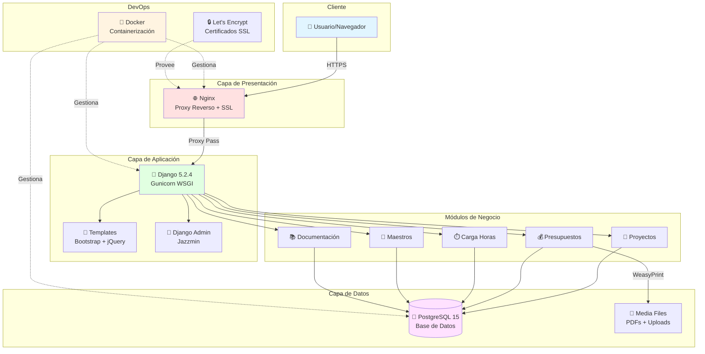

# 🏗️ Ecodisseny - Sistema de Gestión de Proyectos

<div align="center">

[](https://www.linux.org/)
[](https://www.djangoproject.com/)
[](https://www.postgresql.org/)
[](https://www.docker.com/)
[](https://www.python.org/)


_Sistema completo de gestión de proyectos, presupuestos y recursos para Ecodisseny_

</div>

## 📋 Tabla de Contenidos

- [🚀 Características](#-características)
- [🛠️ Tecnologías](#️-tecnologías)
- [⚡ Inicio Rápido](#-inicio-rápido)
- [🐳 Desarrollo con Docker](#-desarrollo-con-docker)
- [🚀 Despliegue en Producción](#-despliegue-en-producción)
- [📂 Estructura del Proyecto](#-estructura-del-proyecto)
- [👥 Usuarios por Defecto](#-usuarios-por-defecto)
- [🔧 Configuración](#-configuración)
- [� Documentación de Uso](#-documentación-de-uso)
- [�📖 API y Endpoints](#-api-y-endpoints)
- [🤝 Contribución](#-contribución)
- [📄 Licencia](#-licencia)

## 🚀 Características

### 🎯 **Funcionalidades Principales**

- **🏢 Gestión de Proyectos**: Creación, seguimiento y control de proyectos
- **💰 Presupuestos**: Generación automática de presupuestos en PDF
- **👥 Gestión de Recursos**: Control de personal y recursos asignados
- **⏱️ Carga de Horas**: Sistema de registro de tiempo trabajado
- **📊 Reportes**: Informes detallados y analytics
- **🔐 Autenticación**: Sistema de usuarios con diferentes roles
- **📱 Responsive**: Interface adaptada para móviles y tablets

### 🎨 **Interface y UX**

- **Admin Moderno**: Interface de administración con Django Jazzmin
- **Autocompletado**: Campos inteligentes con django-autocomplete-light
- **Widgets Mejorados**: Controles de formulario optimizados
- **PDF Profesionales**: Generación de documentos con WeasyPrint

## 🛠️ Tecnologías

### **Backend**

- **Django 5.2.4** - Framework web principal
- **PostgreSQL 15** - Base de datos principal
- **Gunicorn** - Servidor WSGI para producción
- **WeasyPrint** - Generación de PDFs

### **Frontend**

- **Django Templates** - Sistema de plantillas
- **Bootstrap** - Framework CSS
- **jQuery** - Interactividad JavaScript
- **FontAwesome** - Iconografía

### **DevOps & Infraestructura**

- **Docker & Docker Compose** - Containerización
- **Nginx** - Servidor web y proxy reverso
- **Let's Encrypt** - Certificados SSL gratuitos
- **Multi-stage builds** - Optimización de imágenes Docker

### **Librerías Especializadas**

- **psycopg2-binary** - Conector PostgreSQL
- **django-phonenumber-field** - Validación de teléfonos
- **python-decouple** - Gestión de configuración
- **pillow** - Procesamiento de imágenes

## 📊 Arquitectura del Sistema



### **Flujo de Trabajo**

1. **Usuario** accede a través del navegador via HTTPS
2. **Nginx** maneja SSL y redirige al contenedor Django
3. **Django + Gunicorn** procesa las peticiones
4. **Módulos de negocio** gestionan la lógica específica
5. **PostgreSQL** almacena los datos de manera persistente
6. **WeasyPrint** genera PDFs bajo demanda
7. **Docker** orquesta todos los servicios

## ⚡ Inicio Rápido

### 📋 **Prerrequisitos**

- **Docker** 20.0+ y **Docker Compose** 2.0+
- **Git** para clonar el repositorio
- **4GB RAM** mínimo recomendado

### 🚀 **Instalación en Desarrollo**

```bash
# 1. Clonar el repositorio
git clone https://github.com/tuusuario/ecodisseny_dj_pg.git
cd ecodisseny_dj_pg

# 2. Cambiar a la rama docker
git checkout docker

# 3. Levantar la aplicación
docker-compose up --build

# 4. ¡Listo! La aplicación está en http://localhost:8000
```

### 🎉 **¡Ya puedes empezar!**

- **Aplicación**: http://localhost:8000
- **Admin**: http://localhost:8000/admin/
- **Usuario admin**: `mulastone` / `Santom@E14`
- **Otros usuarios**: `gonzalo`, `sarah`, etc. / `ecodisseny2024`

## 🐳 Desarrollo con Docker

### **🔧 Comandos Útiles**

```bash
# Levantar servicios
docker-compose up -d

# Ver logs en tiempo real
docker-compose logs -f web

# Ejecutar comandos Django
docker-compose exec web python manage.py shell
docker-compose exec web python manage.py createsuperuser

# Aplicar migraciones
docker-compose exec web python manage.py migrate

# Recolectar archivos estáticos
docker-compose exec web python manage.py collectstatic

# Parar servicios
docker-compose down

# Reconstruir imágenes
docker-compose build --no-cache
```

### **📊 Gestión de Datos**

```bash
# Cargar fixtures manualmente
docker-compose exec web python manage.py loaddata maestros/fixtures/recurso.json

# Backup de base de datos
docker-compose exec db pg_dump -U ecodisseny ecodisseny_db > backup.sql

# Restaurar backup
cat backup.sql | docker-compose exec -T db psql -U ecodisseny ecodisseny_db

# Ver volúmenes persistentes
docker volume ls | grep ecodisseny
```

### **🔍 Debugging**

```bash
# Entrar al contenedor web
docker-compose exec web bash

# Entrar al contenedor de base de datos
docker-compose exec db psql -U ecodisseny ecodisseny_db

# Ver logs específicos
docker-compose logs web
docker-compose logs db

# Monitorear recursos
docker stats
```

## 🚀 Despliegue en Producción

### **🌐 VPS + Dominio**

Para desplegar en un VPS con dominio propio:

#### **1. Preparar VPS**

```bash
# Actualizar sistema (Ubuntu/Debian)
sudo apt update && sudo apt upgrade -y

# Instalar Docker
curl -fsSL https://get.docker.com -o get-docker.sh
sudo sh get-docker.sh

# Instalar Docker Compose
sudo apt install -y docker-compose

# Configurar usuario
sudo usermod -aG docker $USER
```

#### **2. Configurar Aplicación**

```bash
# Clonar en el VPS
git clone https://github.com/tuusuario/ecodisseny_dj_pg.git
cd ecodisseny_dj_pg
git checkout docker

# Configurar variables de entorno
cp .env.example .env
nano .env  # Editar con tus datos

# Variables importantes:
# DOMAIN_NAME=tudominio.com
# SERVER_IP=IP_DE_TU_VPS
# DB_PASSWORD=password_super_seguro
# SECRET_KEY=clave_secreta_larga
# EMAIL=tu@email.com
```

#### **3. Despliegue Automatizado**

```bash
# Primer despliegue (HTTP)
./deploy.sh

# Configurar SSL (DESPUÉS del primer despliegue)
./setup-ssl.sh

# ¡Tu aplicación está en https://tudominio.com!
```

### **🔒 Configuración SSL**

El script `setup-ssl.sh` configura automáticamente:

- ✅ Certificados Let's Encrypt gratuitos
- ✅ Renovación automática
- ✅ Redirección HTTP → HTTPS
- ✅ Headers de seguridad
- ✅ Configuración SSL A+ rating

### **📊 Monitoreo en Producción**

```bash
# Ver estado de servicios
docker-compose -f docker-compose.prod.yml ps

# Logs en tiempo real
docker-compose -f docker-compose.prod.yml logs -f

# Backup automatizado (configurar en cron)
0 2 * * * /home/ecodisseny/ecodisseny_dj_pg/backup.sh
```

## 📂 Estructura del Proyecto

```
ecodisseny_dj_pg/
├── 🐳 Docker & Despliegue
│   ├── Dockerfile                   # Imagen Docker multi-stage
│   ├── docker-compose.yml          # Desarrollo local
│   ├── docker-compose.prod.yml     # Producción VPS
│   ├── .dockerignore               # Exclusiones Docker
│   ├── deploy.sh                   # Script de despliegue
│   └── setup-ssl.sh               # Configuración SSL
│
├── 🌐 Configuración Web
│   └── nginx/
│       ├── nginx.conf              # Configuración principal
│       └── default.conf            # Virtual host
│
├── ⚙️ Configuración Django
│   ├── ecodisseny/
│   │   ├── settings.py             # Configuración principal
│   │   ├── urls.py                 # URLs principales
│   │   └── wsgi.py                 # WSGI para producción
│   ├── requirements.txt            # Dependencias Python
│   └── manage.py                   # CLI Django
│
├── 📱 Aplicaciones Django
│   ├── accounts/                   # Autenticación y usuarios
│   ├── maestros/                   # Datos maestros (recursos, ubicaciones)
│   ├── projectes/                  # Gestión de proyectos
│   ├── pressupostos/              # Presupuestos y cotizaciones
│   └── carregahores/              # Carga de horas y timetracking
│
├── 🎨 Frontend
│   ├── templates/                  # Plantillas HTML
│   ├── static/                     # CSS, JS, imágenes
│   └── media/                      # Uploads y archivos generados
│
├── 📊 Datos Iniciales
│   ├── maestros/fixtures/          # Datos maestros iniciales
│   ├── docker-load-fixtures.sh    # Script de carga automática
│   └── create_users_profiles.py   # Creación de usuarios
│
└── 📚 Documentación
    ├── README.md                   # Este archivo
    ├── .env.example               # Template de configuración
    └── recomendaciones.md         # Guías adicionales
```

## 👥 Usuarios por Defecto

El sistema viene preconfigurado con usuarios de ejemplo:

### **🔑 Administradores**

| Usuario     | Contraseña       | Rol                    | Email                    |
| ----------- | ---------------- | ---------------------- | ------------------------ |
| `mulastone` | `Santom@E14`     | Superusuario Principal | mulastone@ecodisseny.com |
| `gonzalo`   | `ecodisseny2024` | Administrador          | gonzalo@ecodisseny.com   |

### **👤 Usuarios Normales**

| Usuario    | Contraseña       | Recurso Asignado | Email                   |
| ---------- | ---------------- | ---------------- | ----------------------- |
| `pilar`    | `ecodisseny2024` | Pilar            | pilar@ecodisseny.com    |
| `roger`    | `ecodisseny2024` | Roger            | roger@ecodisseny.com    |
| `santiago` | `ecodisseny2024` | Santiago         | santiago@ecodisseny.com |
| `sarah`    | `ecodisseny2024` | Sarah            | sarah@ecodisseny.com    |

### **🎯 Accesos**

- **Panel Admin**: http://localhost:8000/admin/
- **Aplicación**: http://localhost:8000/
- **Login**: http://localhost:8000/accounts/login/
- **Logout**: http://localhost:8000/accounts/logout/

## 🔧 Configuración

### **🌍 Variables de Entorno**

El archivo `.env` contiene toda la configuración sensible:

```bash
# Dominio y servidor
DOMAIN_NAME=localhost                    # tudominio.com en producción
SERVER_IP=127.0.0.1                    # IP real del VPS en producción

# Base de datos
DB_HOST=db                              # Hostname del contenedor
DB_PORT=5432                            # Puerto PostgreSQL
DB_NAME=ecodisseny_db                   # Nombre de la base de datos
DB_USER=ecodisseny                      # Usuario de la BD
DB_PASSWORD=ecodisseny2024              # Cambiar en producción

# Django
SECRET_KEY=tu_secret_key_aqui           # Generar uno nuevo en producción
DEBUG=True                              # False en producción
ALLOWED_HOSTS=localhost,127.0.0.1       # Agregar dominio en producción

# Email (opcional)
EMAIL_HOST=smtp.gmail.com
EMAIL_PORT=587
EMAIL_HOST_USER=tu@gmail.com
EMAIL_HOST_PASSWORD=tu_app_password
```

### **🔐 Seguridad en Producción**

Para producción, **SIEMPRE**:

1. **Generar SECRET_KEY nueva**:

   ```python
   from django.core.management.utils import get_random_secret_key
   print(get_random_secret_key())
   ```

2. **Cambiar contraseñas por defecto**
3. **Configurar `DEBUG=False`**
4. **Configurar `ALLOWED_HOSTS` correctamente**
5. **Usar contraseñas fuertes para PostgreSQL**

### **📊 Base de Datos**

El sistema incluye datos iniciales (fixtures) que se cargan automáticamente:

- **Tipos de Recurso**: Personal, Equipamiento, Vehículos
- **Recursos**: Gonzalo, Sarah, Pilar, Santiago, Roger
- **Ubicaciones**: Parroquias y poblaciones de Andorra
- **Tareas y Trabajos**: Catálogo predefinido
- **Desplazamientos**: Matriz de distancias

## � Documentación de Uso

### **📖 Guías Completas por Tipo de Usuario**

La documentación completa está disponible en la carpeta [`docs/`](docs/):

#### **👤 Para Usuarios**

- **[🚀 Guía de Inicio Rápido](docs/usuario/inicio-rapido.md)** - Primeros pasos en el sistema
- **[🏗️ Gestión de Proyectos](docs/usuario/proyectos.md)** - Crear y administrar proyectos
- **[💰 Presupuestos](docs/usuario/presupuestos.md)** - Cotizaciones y documentos PDF
- **[⏱️ Carga de Horas](docs/usuario/carga-horas.md)** - Registro de tiempo trabajado
- **[📈 Reportes](docs/usuario/reportes.md)** - Informes y estadísticas

#### **🔧 Para Administradores**

- **[⚙️ Configuración Inicial](docs/admin/configuracion.md)** - Setup completo del sistema
- **[👥 Gestión de Usuarios](docs/admin/usuarios.md)** - Usuarios, roles y permisos
- **[🏗️ Datos Maestros](docs/admin/datos-maestros.md)** - Recursos, ubicaciones, tareas
- **[🔐 Seguridad](docs/admin/seguridad.md)** - Configuración de seguridad
- **[📊 Mantenimiento](docs/admin/mantenimiento.md)** - Backups y monitoreo

#### **🛠️ Para Desarrolladores**

- **[🏗️ Arquitectura](docs/dev/arquitectura.md)** - Estructura técnica
- **[🔌 API Reference](docs/dev/api.md)** - Endpoints disponibles
- **[🎨 Personalización](docs/dev/personalizacion.md)** - Modificar interface
- **[🐛 Debugging](docs/dev/debugging.md)** - Solución de problemas

### **🎯 Inicio Rápido por Rol**

| Tu Rol                  | Empezar Aquí                                         | Objetivo                         |
| ----------------------- | ---------------------------------------------------- | -------------------------------- |
| **👤 Usuario Nuevo**    | [Inicio Rápido](docs/usuario/inicio-rapido.md)       | Aprender lo básico en 15 minutos |
| **🏗️ Jefe de Proyecto** | [Gestión de Proyectos](docs/usuario/proyectos.md)    | Dominar la gestión completa      |
| **🔧 Administrador**    | [Configuración Inicial](docs/admin/configuracion.md) | Setup completo del sistema       |
| **🛠️ Desarrollador**    | [Arquitectura](docs/dev/arquitectura.md)             | Entender la estructura técnica   |

## �📖 API y Endpoints

### **🔗 URLs Principales**

```python
# Aplicación principal
/                           # Dashboard principal
/accounts/login/            # Login de usuarios
/accounts/logout/           # Logout
/admin/                     # Panel de administración

# Gestión de proyectos
/projectes/                 # Listado de proyectos
/projectes/create/          # Crear nuevo proyecto
/projectes/<id>/            # Detalle de proyecto

# Presupuestos
/pressupostos/              # Listado de presupuestos
/pressupostos/create/       # Crear presupuesto
/pressupostos/<id>/pdf/     # Generar PDF

# Carga de horas
/carregahores/              # Registro de horas
/carregahores/report/       # Reportes de tiempo
```

### **🎨 Autocompletado AJAX**

El sistema incluye endpoints de autocompletado para:

- **Recursos**: `/maestros/recurso-autocomplete/`
- **Proyectos**: `/projectes/projecte-autocomplete/`
- **Tareas**: `/maestros/tasca-autocomplete/`
- **Ubicaciones**: `/maestros/ubicacio-autocomplete/`

### **🧪 Testing**

```bash
# Ejecutar tests
docker-compose exec web python manage.py test

# Coverage
docker-compose exec web coverage run --source='.' manage.py test
docker-compose exec web coverage report
```

### **📝 Estándares de Código**

- **PEP 8** para Python
- **Docstrings** para funciones importantes
- **Comentarios** en español para lógica compleja
- **Nombres descriptivos** para variables y funciones

## 📄 Licencia

Este proyecto está bajo la licencia MIT. Ver el archivo `LICENSE` para más detalles.

---

<div align="center">

**🏗️ Desarrollado por Axel Rasmussen para Ecodisseny**

_Sistema de gestión integral para proyectos de construcción y diseño_

[](https://djangoproject.com/)
[](https://docker.com/)
[](https://postgresql.org/)

</div>

---
