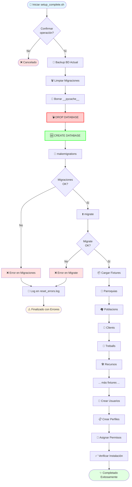
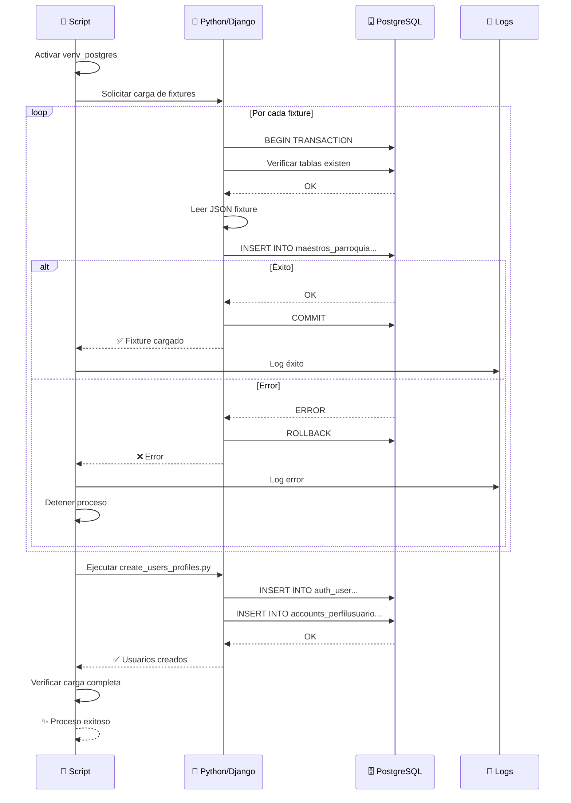
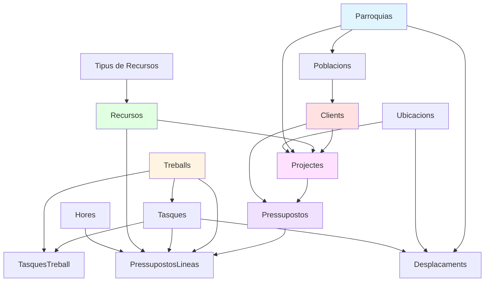
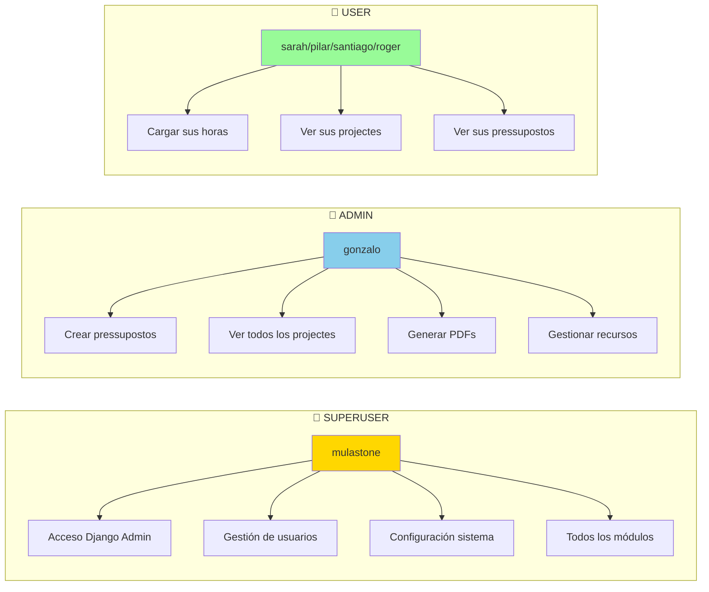

# 🚀 Scripts de Reinicio y Configuración - Ecodisseny

Este conjunto de scripts permite reiniciar completamente el proyecto Django y configurar todos los datos necesarios de forma automatizada y segura.

## 📑 Índice

- [📋 Scripts Disponibles](#-scripts-disponibles)
- [🔄 Flujo de Ejecución](#-flujo-de-ejecución)
- [👥 Usuarios Creados](#-usuarios-creados)
- [📊 Casos de Uso](#-casos-de-uso)
- [🔧 Configuración Avanzada](#-configuración-avanzada)
- [⚠️ Troubleshooting](#️-troubleshooting)

## 📋 Scripts Disponibles

### 🎯 `setup_complete.sh` - Script Maestro

**Reinicio completo del proyecto en un solo comando**

```bash
./setup_complete.sh
```

#### ¿Qué hace este script?

Este script ejecuta automáticamente **TODO el proceso de reinicio** del proyecto:

1. **🗑️ Limpieza de migraciones**: Elimina todos los archivos de migración excepto `__init__.py`
2. **🗄️ Backup de BD**: (Opcional) Realiza backup de la base de datos actual
3. **💣 DROP/CREATE DB**: Elimina y recrea la base de datos PostgreSQL limpia
4. **🔄 Makemigrations**: Regenera archivos de migración para todas las apps
5. **⬆️ Migrate**: Aplica todas las migraciones a la BD
6. **📦 Load Fixtures**: Carga datos maestros (clientes, recursos, trabajos, etc.)
7. **👥 Create Users**: Crea usuarios administradores y operarios con sus perfiles
8. **✅ Verificación**: Comprueba que todo se ha creado correctamente

#### Cuándo usarlo

- ✅ Primera instalación del proyecto
- ✅ Después de cambios grandes en modelos
- ✅ Cuando hay conflictos de migraciones irresolubles
- ✅ Para restaurar el proyecto a un estado conocido
- ❌ En producción sin backup previo
- ❌ Si solo necesitas actualizar fixtures

---

### 🔧 Scripts Individuales

#### 🔄 `reset_migrations.sh`

**Reinicia completamente las migraciones y la base de datos**

```bash
./reset_migrations.sh
```

**Proceso detallado:**

```bash
# 1. Elimina archivos de migración
find . -path "*/migrations/*.py" -not -name "__init__.py" -delete
find . -path "*/migrations/*.pyc" -delete

# 2. Limpia la caché de Python
find . -type d -name __pycache__ -exec rm -r {} +

# 3. Resetea PostgreSQL (requiere permisos)
psql -U postgres -c "DROP DATABASE IF EXISTS ecodisseny_db;"
psql -U postgres -c "CREATE DATABASE ecodisseny_db;"

# 4. Regenera migraciones
python manage.py makemigrations
python manage.py migrate
```

**⚠️ ADVERTENCIA**: Este script **ELIMINA TODOS LOS DATOS**. Úsalo solo en desarrollo.

---

#### 📦 `load_fixtures.sh`

**Carga fixtures maestros y crea usuarios del sistema**

```bash
./load_fixtures.sh
```

**Orden de carga:**

1. **Parroquias** → Ubicaciones geográficas base
2. **Poblaciones** → Poblaciones asociadas a parroquias
3. **Departamentos** → Departamentos de clientes
4. **Clientes** → Clientes principales del sistema
5. **Trabajos** → Tipos de trabajos disponibles
6. **Tareas** → Tareas específicas por trabajo
7. **Tipos de Recursos** → Categorías de recursos
8. **Recursos** → Recursos humanos y materiales
9. **Ubicaciones** → Ubicaciones específicas de trabajo
10. **Horas** → Rangos de horas estándar
11. **Desplazamientos** → Incrementos por desplazamiento
12. **👥 Usuarios y Perfiles** → Ejecuta `create_users_profiles.py`

**Cuándo usarlo:**

- ✅ Después de `reset_migrations.sh`
- ✅ Para restaurar datos maestros sin tocar migraciones
- ✅ En entornos de desarrollo nuevos
- ⚠️ Requiere que las migraciones estén aplicadas

---

#### 📤 `generate_fixtures.sh`

**Genera fixtures JSON desde los datos actuales de la BD**

```bash
./generate_fixtures.sh
```

**Apps exportadas:**

- `maestros`: Todos los modelos (Clients, Treballs, Recursos, etc.)
- `projectes`: Proyectos existentes
- `pressupostos`: Presupuestos y líneas
- `auth.User`: Usuarios (sin contraseñas sensibles)

**Archivos generados:**

```
maestros/fixtures/
├── parroquias.json
├── poblacions.json
├── departaments.json
├── clients.json
├── treballs.json
├── tasques.json
├── tipus_recursos.json
├── recursos.json
├── ubicacions.json
├── hores.json
└── desplacaments.json
```

**Cuándo usarlo:**

- ✅ Para crear backup de datos en formato fixture
- ✅ Antes de cambios grandes en la estructura
- ✅ Para compartir datos de prueba entre desarrolladores
- ✅ Para documentar estado de la BD

---

#### 🐳 `docker-manager.sh`

**Gestiona contenedores Docker del proyecto**

```bash
./docker-manager.sh [comando]
```

**Comandos disponibles:**

| Comando | Descripción                           |
| ------- | ------------------------------------- |
| `start` | Inicia contenedores                   |
| `stop`  | Detiene contenedores                  |
| `reset` | Reinicia contenedores y volúmenes     |
| `logs`  | Muestra logs en tiempo real           |
| `shell` | Abre shell en el contenedor Django    |
| `psql`  | Abre shell PostgreSQL                 |
| `clean` | Limpia contenedores, volúmenes y caché |

---

#### 🗄️ `backup-all-dbs.sh`

**Crea backup completo de todas las bases de datos**

```bash
./backup-all-dbs.sh
```

**Genera:**

- Dump SQL de la BD completa
- Timestamp en el nombre del archivo
- Compresión automática (opcional)
- Ubicación: `./backups/ecodisseny_YYYYMMDD_HHMMSS.sql`

---

#### 👤 `create_users_profiles.py`

**Crea usuarios del sistema y sus perfiles asociados**

```bash
python create_users_profiles.py
```

**Proceso interno:**

1. Verifica si el usuario ya existe
2. Crea usuario con contraseña hasheada
3. Busca el recurso asociado en BD
4. Crea PerfilUsuario vinculado al recurso
5. Asigna permisos según tipo (ADMIN/USER)

---

## 🔄 Flujo de Ejecución

### Diagrama de Flujo - Setup Completo



### Diagrama de Secuencia - Carga de Fixtures



### Orden de Dependencias de Fixtures



---

## 👥 Usuarios Creados

### Tabla de Usuarios

| Usuario   | Tipo  | Recurso  | Contraseña     | Permisos                              |
| --------- | ----- | -------- | -------------- | ------------------------------------- |
| mulastone | ADMIN | -        | ecodisseny2024 | Superusuario, acceso total            |
| gonzalo   | ADMIN | Gonzalo  | ecodisseny2024 | Admin pressupostos, gestión completa  |
| sarah     | USER  | Sarah    | ecodisseny2024 | Cargar horas propias                  |
| pilar     | USER  | Pilar    | ecodisseny2024 | Cargar horas propias                  |
| santiago  | USER  | Santiago | ecodisseny2024 | Cargar horas propias                  |
| roger     | USER  | Roger    | ecodisseny2024 | Cargar horas propias                  |

### 🔐 Niveles de Permisos



### Creación de Usuario Personalizado

Para crear un nuevo usuario manualmente:

```python
from django.contrib.auth.models import User
from accounts.models import PerfilUsuario
from maestros.models import Recurso

# 1. Obtener el recurso
recurso = Recurso.objects.get(name="Nombre del Recurso")

# 2. Crear usuario
user = User.objects.create_user(
    username='nuevo_usuario',
    password='contraseña_segura',
    email='usuario@email.com',
    first_name='Nombre',
    last_name='Apellido'
)

# 3. Crear perfil
perfil = PerfilUsuario.objects.create(
    user=user,
    recurso=recurso,
    tipo='USER'  # o 'ADMIN'
)

print(f"✅ Usuario {user.username} creado con éxito")
```

---

## 📊 Casos de Uso

### 🎯 Caso 1: Primera Instalación

```bash
# 1. Clonar repositorio
git clone <repo-url>
cd ecodisseny_dj_pg

# 2. Crear entorno virtual
python3 -m venv venv_postgres
source venv_postgres/bin/activate

# 3. Instalar dependencias
pip install -r requirements.txt

# 4. Configurar .env
cp .env.example .env
# Editar .env con tus credenciales

# 5. Ejecutar setup completo
./setup_complete.sh

# 6. Levantar servidor
python manage.py runserver
```

---

### 🔄 Caso 2: Actualizar Fixtures sin Tocar la BD

```bash
# Escenario: Has modificado los fixtures JSON y quieres recargarlos

# Opción A: Recrear BD completa (desarrollo)
./setup_complete.sh

# Opción B: Solo recargar fixtures (si no hay cambios estructurales)
python manage.py flush --no-input  # Vacía datos pero mantiene estructura
./load_fixtures.sh
```

---

### 🐛 Caso 3: Resolver Conflictos de Migraciones

```bash
# Problema: "Migration conflicts detected"

# Solución 1: Reseteo completo (desarrollo)
./reset_migrations.sh
./load_fixtures.sh

# Solución 2: Squash migrations (producción)
python manage.py squashmigrations maestros 0001 0010
python manage.py squashmigrations pressupostos 0001 0008
python manage.py migrate
```

---

### 💾 Caso 4: Backup y Restauración

```bash
# Hacer backup antes de cambios importantes
./backup-all-dbs.sh

# Si algo sale mal, restaurar
psql -U postgres -d ecodisseny_db < backups/ecodisseny_20260208_143022.sql

# O usar Docker
docker exec -i postgres_container psql -U postgres ecodisseny_db < backup.sql
```

---

### 🐳 Caso 5: Trabajar con Docker

```bash
# Iniciar proyecto en Docker
docker-compose up --build

# Resetear base de datos en Docker
./docker-manager.sh reset

# Ejecutar setup dentro del contenedor
./docker-manager.sh shell
./setup_complete.sh

# Ver logs en tiempo real
./docker-manager.sh logs
```

---

## 🔧 Configuración Avanzada

### Variables de Entorno

Crea un archivo `.env` en la raíz del proyecto:

```bash
# Base de Datos
DB_NAME=ecodisseny_db
DB_USER=postgres
DB_PASSWORD=tu_contraseña
DB_HOST=localhost
DB_PORT=5432

# Django
SECRET_KEY=tu_secret_key_super_segura
DEBUG=True
ALLOWED_HOSTS=localhost,127.0.0.1

# Fixtures
FIXTURES_DIR=maestros/fixtures/
AUTO_BACKUP=True
```

### Personalizar Scripts

Modifica las variables al inicio de cada script:

```bash
# En setup_complete.sh
VENV_PATH="./venv_postgres"          # Ruta del entorno virtual
DB_NAME="ecodisseny_db"               # Nombre de la BD
BACKUP_DIR="./backups"                # Directorio de backups
CREATE_BACKUP=true                    # Hacer backup automático
FIXTURES_DIR="maestros/fixtures"      # Directorio de fixtures
```

---

## ⚠️ Troubleshooting

### Problema: "Permission denied" al ejecutar scripts

```bash
# Solución: Dar permisos de ejecución
chmod +x setup_complete.sh
chmod +x reset_migrations.sh
chmod +x load_fixtures.sh
chmod +x generate_fixtures.sh
```

---

### Problema: "psql: FATAL: Peer authentication failed"

```bash
# Solución 1: Editar pg_hba.conf
sudo nano /etc/postgresql/15/main/pg_hba.conf

# Cambiar:
# local   all   postgres   peer
# Por:
# local   all   postgres   md5

# Reiniciar PostgreSQL
sudo systemctl restart postgresql
```

```bash
# Solución 2: Usar conexión TCP
psql -h localhost -U postgres -d ecodisseny_db
```

---

### Problema: "relation does not exist" al cargar fixtures

```bash
# Causa: Las migraciones no están aplicadas

# Solución:
python manage.py migrate
./load_fixtures.sh
```

---

### Problema: "Fixture could not be loaded: Problem installing fixture"

```bash
# Causa: Orden incorrecto de fixtures o datos duplicados

# Solución:
# 1. Verificar orden de dependencias
# 2. Limpiar BD y volver a cargar
python manage.py flush
./load_fixtures.sh

# 3. O resetear todo
./reset_migrations.sh
./load_fixtures.sh
```

---

### Problema: "venv_postgres: No such file or directory"

```bash
# Solución: Crear entorno virtual
python3 -m venv venv_postgres
source venv_postgres/bin/activate
pip install -r requirements.txt
```

---

### Problema: Fixtures antiguos no funcionan después de cambiar modelos

```bash
# Solución: Regenerar fixtures desde datos actuales
./generate_fixtures.sh

# O editar manualmente los JSON fixtures para reflejar nuevos campos
```

---

## 🚀 Uso Recomendado

### ✅ Recomendaciones de Desarrollo

1. **Antes de cambios grandes**: Ejecuta `./backup-all-dbs.sh`
2. **Después de cambiar modelos**: Ejecuta `./reset_migrations.sh`
3. **Al inicio del día**: Ejecuta `git pull` y verifica si hay migraciones nuevas
4. **Antes de commit**: Asegúrate de que las migraciones estén incluidas
5. **Testing local**: Usa `./setup_complete.sh` para entorno limpio

### ⚠️ Advertencias de Producción

- ❌ **NUNCA** ejecutes `reset_migrations.sh` en producción
- ✅ **SIEMPRE** haz backup antes de cualquier operación
- ✅ **USA** migrations squashing para mantener historial limpio
- ✅ **PRUEBA** los scripts primero en staging
- ✅ **DOCUMENTA** cualquier cambio en fixtures

---

## 📁 Estructura de Fixtures

```
maestros/fixtures/
├── 01_parroquias.json          # Paso 1: Ubicaciones base
├── 02_poblacions.json          # Paso 2: Poblaciones
├── 03_departaments.json         # Paso 3: Departamentos
├── 04_clients.json             # Paso 4: Clientes
├── 05_treballs.json            # Paso 5: Tipos de trabajo
├── 06_tasques.json             # Paso 6: Tareas
├── 07_tasques_treball.json     # Paso 7: Relación tareas-trabajos
├── 08_tipus_recursos.json      # Paso 8: Tipos de recursos
├── 09_recursos.json            # Paso 9: Recursos
├── 10_ubicacions.json          # Paso 10: Ubicaciones específicas
├── 11_hores.json               # Paso 11: Rangos de horas
└── 12_desplacaments.json       # Paso 12: Incrementos desplazamiento
```

### Formato de Fixture

```json
[
  {
    "model": "maestros.recurso",
    "pk": 1,
    "fields": {
      "name": "Gonzalo",
      "preu_hora": "25.50",
      "preu_tancat": false,
      "id_tipus_recurso": 1
    }
  }
]
```

---

## ⚙️ Requisitos del Sistema

### Software Necesario

- **Python** 3.10+
- **PostgreSQL** 12+
- **pip** (gestor de paquetes Python)
- **git** (control de versiones)
- **virtualenv** o **venv**

### Librerías Python

Ver `requirements.txt` para lista completa:

```
Django==5.2.4
psycopg2-binary==2.9.9
django-jazzmin==2.6.0
WeasyPrint==59.0
python-decouple==3.8
```

### Hardware Mínimo

- **RAM**: 2GB mínimo, 4GB recomendado
- **Disco**: 1GB espacio libre
- **CPU**: Cualquier procesador moderno

---

**¡Listo para empezar!** 🎉

Si encuentras algún error o tienes sugerencias, por favor abre un issue en GitHub.
