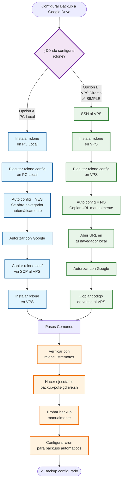
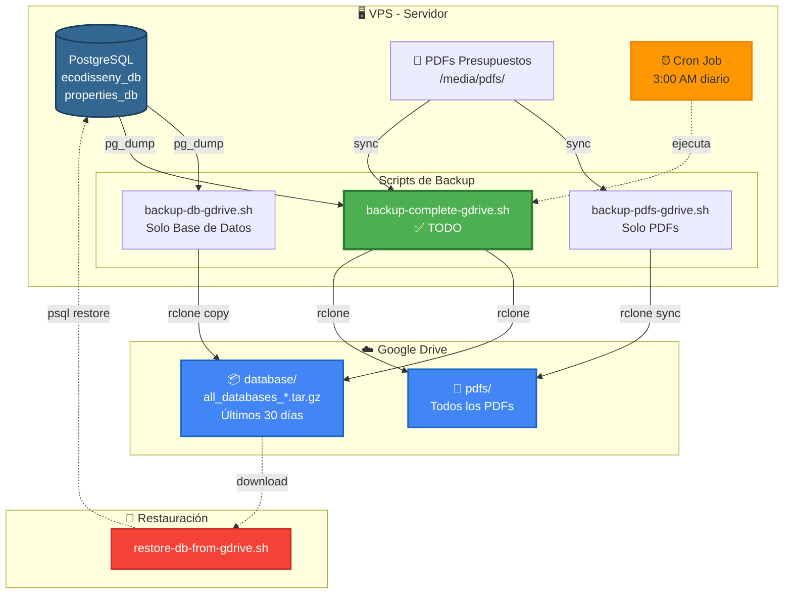

# Configuración de Backup Automático a Google Drive

## Elige tu método de configuración

Hay **dos formas** de configurar rclone para Google Drive:

- **Opción A (PC Local → VPS)**: Configuras en tu PC y copias la configuración al VPS
- **Opción B (Directa en VPS)**: Configuras directamente en el VPS vía SSH ✅ **MÁS SIMPLE**



---

# OPCIÓN A: Configurar desde PC Local y copiar al VPS

## Paso 1: Instalar rclone en tu PC LOCAL (Linux)

```bash
# En tu PC local
curl https://rclone.org/install.sh | sudo bash
```

## Paso 2: Configurar Google Drive en tu PC LOCAL

```bash
rclone config
```

Sigue estos pasos:
1. Presiona `n` para nuevo remote
2. Nombre: `gdrive`
3. Tipo de storage: escribe `drive` (o el número que corresponda a Google Drive)
4. **client_id**: Déjalo en blanco (Enter)
5. **client_secret**: Déjalo en blanco (Enter)
6. **scope**: `1` (Full access)
7. **root_folder_id**: Déjalo en blanco (Enter)
8. **service_account_file**: Déjalo en blanco (Enter)
9. **Edit advanced config?**: `n`
10. **Use auto config?**: `y` (se abrirá el navegador)
11. Autoriza con tu cuenta de Google
12. Confirma la configuración: `y`
13. Sal del config: `q`

## Paso 3: Copiar configuración al VPS

```bash
# En tu PC local
scp ~/.config/rclone/rclone.conf root@TU_IP_VPS:~/.config/rclone/
```

O si el usuario no es root:
```bash
scp ~/.config/rclone/rclone.conf usuario@TU_IP_VPS:~/.config/rclone/
```

## Paso 4: Instalar rclone en el VPS

```bash
# SSH al VPS
ssh usuario@TU_IP_VPS

# Instalar rclone
curl https://rclone.org/install.sh | sudo bash
```

## Paso 5: Verificar que funciona en el VPS

```bash
# En el VPS
rclone listremotes
# Debería mostrar: gdrive:

# Probar listado
rclone lsd gdrive:
```

---

# OPCIÓN B: Configurar directamente en el VPS (vía SSH) ✅ RECOMENDADO

## Paso 1: Conectar al VPS e instalar rclone

```bash
# Conectarte al VPS
ssh usuario@TU_IP_VPS

# Instalar rclone
curl https://rclone.org/install.sh | sudo bash
```

## Paso 2: Iniciar configuración de Google Drive

```bash
rclone config
```

## Paso 3: Configurar el remote (sigue estos pasos)

```
e/n/d/r/c/s/q> n         # Nuevo remote
name> gdrive              # Nombre del remote
Storage> drive            # Escribe "drive" o el número de Google Drive
client_id>                # Presiona Enter (dejar en blanco)
client_secret>            # Presiona Enter (dejar en blanco)
scope> 1                  # Opción 1 = Full access
root_folder_id>           # Presiona Enter (dejar en blanco)
service_account_file>     # Presiona Enter (dejar en blanco)
Edit advanced config? (y/n)> n   # No
Use auto config? (y/n)> n         # ⚠️ IMPORTANTE: Responde "n" (NO)
```

## Paso 4: Autorizar con Google (lo importante)

Después de responder `n` a "Use auto config?", verás algo como:

```
Please go to the following link: https://accounts.google.com/o/oauth2/auth?access_type=offline&client_id=XXXXXXX...
```

**Ahora:**
1. **Copia toda esa URL** (puede ser muy larga)
2. **Ábrela en tu navegador** (en tu PC/móvil)
3. **Autoriza con tu cuenta de Google** (la que usarás para backups)
4. Google te mostrará un **código de verificación**
5. **Copia ese código**
6. **Pégalo en el terminal del VPS** donde dice "Enter verification code>"
7. Presiona Enter

## Paso 5: Finalizar configuración

```
Configure this as a team drive? (y/n)> n   # No (a menos que uses Google Workspace)
Yes this is OK (y/n)> y                    # Confirmar
e/n/d/r/c/s/q> q                           # Salir del config
```

## Paso 6: Verificar que funciona

```bash
# Listar remotes configurados
rclone listremotes
# Debería mostrar: gdrive:

# Probar listado de Google Drive
rclone lsd gdrive:

# Ver tu espacio disponible
rclone about gdrive:
```

---

# Pasos Comunes (para ambas opciones)

## Paso 1: Hacer ejecutable el script de backup

```bash
# En el VPS, dentro del directorio del proyecto
cd /home/mulastone/proyectos/ecodisseny_dj_pg
chmod +x backup-pdfs-gdrive.sh
```

## Paso 2: Probar el backup manualmente

```bash
# Ejecutar una vez para probar
./backup-pdfs-gdrive.sh

# Ver el log
tail -f /var/log/backup-pdfs-gdrive.log
```

## Paso 3: Configurar backup automático diario

```bash
# Editar crontab
crontab -e

# Añadir esta línea (backup diario a las 2:00 AM):
0 2 * * * /home/mulastone/proyectos/ecodisseny_dj_pg/backup-pdfs-gdrive.sh
```

### Alternativas de horario:
```bash
# Cada 6 horas:
0 */6 * * * /home/mulastone/proyectos/ecodisseny_dj_pg/backup-pdfs-gdrive.sh

# Diario a las 3:00 AM:
0 3 * * * /home/mulastone/proyectos/ecodisseny_dj_pg/backup-pdfs-gdrive.sh

# Dos veces al día (2 AM y 2 PM):
0 2,14 * * * /home/mulastone/proyectos/ecodisseny_dj_pg/backup-pdfs-gdrive.sh
```

## Paso 4: Verificar que el cron está activo

```bash
# Ver los cron jobs programados
crontab -l

# Ver el servicio cron
sudo systemctl status cron
```

---

# Comandos útiles

### Ver logs de backup
```bash
tail -f /var/log/backup-pdfs-gdrive.log
cat /var/log/backup-pdfs-gdrive.log | tail -50
```

### Backup manual
```bash
/home/mulastone/proyectos/ecodisseny_dj_pg/backup-pdfs-gdrive.sh
```

### Listar archivos en Google Drive
```bash
rclone ls gdrive:ecodisseny-backups/pdfs
```

### Ver espacio usado en Google Drive
```bash
rclone about gdrive:
```

### Restaurar backup (copiar de Google Drive al VPS)
```bash
rclone sync gdrive:ecodisseny-backups/pdfs /home/mulastone/proyectos/ecodisseny_dj_pg/media/pdfs_pressupostos
```

## Notas importantes

1. **El comando `sync`** sincroniza unidireccionalmente (origen → destino)
2. **Archivos borrados localmente** también se borrarán de Google Drive
3. **15GB gratis** en Google Drive son más que suficientes para años
4. **Los logs** te permiten monitorizar que todo funciona correctamente
5. Si necesitas más espacio, considera crear otra cuenta de Google

## Seguridad

El archivo `~/.config/rclone/rclone.conf` contiene las credenciales. Asegúrate de que:
```bash
chmod 600 ~/.config/rclone/rclone.conf
```

## Troubleshooting

### Error: "Failed to create file system"
- Verifica que el remote esté configurado: `rclone listremotes`
- Prueba reconectar: `rclone config reconnect gdrive:`

### Error de permisos
```bash
sudo chown -R $USER:$USER ~/.config/rclone/
chmod 600 ~/.config/rclone/rclone.conf
```

### Ver si el cron se ejecutó
```bash
grep CRON /var/log/syslog | grep backup
```

---

# Backup de Base de Datos PostgreSQL

## Flujo de Backup Completo



## Scripts creados

Se han creado 3 scripts adicionales para backup de base de datos:

1. **backup-db-gdrive.sh**: Backup solo de base de datos
2. **backup-complete-gdrive.sh**: Backup completo (DB + PDFs) ✅ **RECOMENDADO**
3. **restore-db-from-gdrive.sh**: Restaurar base de datos desde Google Drive

## Configuración de Backup Completo (DB + PDFs)

### Paso 1: Hacer ejecutables los scripts

```bash
cd /home/mulastone/proyectos/ecodisseny_dj_pg
chmod +x backup-db-gdrive.sh
chmod +x backup-complete-gdrive.sh
chmod +x restore-db-from-gdrive.sh
```

### Paso 2: Probar backup de base de datos

```bash
# Probar solo backup de BD
./backup-db-gdrive.sh

# Ver el log
tail -f /var/log/backup-db-gdrive.log
```

### Paso 3: Probar backup completo

```bash
# Ejecutar backup completo (BD + PDFs)
./backup-complete-gdrive.sh

# Ver el log
tail -f /var/log/backup-complete-gdrive.log
```

### Paso 4: Configurar cron para backup automático

```bash
# Editar crontab
crontab -e

# OPCIÓN A: Backup completo diario a las 3:00 AM (RECOMENDADO)
0 3 * * * /home/mulastone/proyectos/ecodisseny_dj_pg/backup-complete-gdrive.sh

# OPCIÓN B: Backups separados
# - Base de datos: diario a las 2:00 AM
# - PDFs: diario a las 4:00 AM
0 2 * * * /home/mulastone/proyectos/ecodisseny_dj_pg/backup-db-gdrive.sh
0 4 * * * /home/mulastone/proyectos/ecodisseny_dj_pg/backup-pdfs-gdrive.sh
```

### Paso 5: Verificar estructura en Google Drive

Después de ejecutar los backups, tu Google Drive tendrá:

```
ecodisseny-backups/
├── database/
│   ├── all_databases_20260208_030000.tar.gz
│   ├── all_databases_20260209_030000.tar.gz
│   └── ...
└── pdfs/
    ├── presupuesto_001.pdf
    ├── presupuesto_002.pdf
    └── ...
```

## Restaurar Base de Datos

### Listar backups disponibles

```bash
./restore-db-from-gdrive.sh
```

Mostrará algo como:
```
📦 Backups disponibles en Google Drive:
========================================
all_databases_20260208_030000.tar.gz
all_databases_20260207_030000.tar.gz
all_databases_20260206_030000.tar.gz
```

### Restaurar un backup específico

```bash
./restore-db-from-gdrive.sh all_databases_20260208_030000.tar.gz
```

El script:
1. ⬇️  Descarga el backup desde Google Drive
2. 📦 Descomprime los archivos
3. ⚠️  Pide confirmación antes de restaurar (para evitar sobreescribir por error)
4. 🔄 Restaura las bases de datos seleccionadas
5. 🧹 Limpia archivos temporales

## Rotación de Backups

Los backups se gestionan automáticamente:

- **Base de datos**: Se mantienen últimos **30 días** (configurable)
- **PDFs**: Se sincronizan siempre (no se borran antiguos)

### Cambiar retención de backups

Edita [backup-db-gdrive.sh](backup-db-gdrive.sh) línea 68:

```bash
# Mantener 7 días
rclone delete "$GDRIVE_REMOTE" --min-age 7d

# Mantener 90 días (3 meses)
rclone delete "$GDRIVE_REMOTE" --min-age 90d

# Mantener 1 año
rclone delete "$GDRIVE_REMOTE" --min-age 365d
```

## Logs de Backup

### Ver logs en tiempo real

```bash
# Backup completo
tail -f /var/log/backup-complete-gdrive.log

# Solo base de datos
tail -f /var/log/backup-db-gdrive.log

# Solo PDFs
tail -f /var/log/backup-pdfs-gdrive.log
```

### Ver últimas 50 líneas

```bash
tail -50 /var/log/backup-complete-gdrive.log
```

### Ver solo errores

```bash
grep ERROR /var/log/backup-complete-gdrive.log
```

## Contenido de los Backups

### Backup de Base de Datos incluye:

- ✅ **ecodisseny_db**: Base de datos principal
- ✅ **properties_db**: Base de datos de scraper
- ✅ Comprimido con gzip (ahorra ~70% espacio)
- ✅ Formato SQL (fácil de restaurar)

### Tamaño estimado:

- Base de datos: ~10-50MB comprimido
- Por día: ~10-50MB
- Por mes: ~300-1500MB
- Año completo: Cabe en los 15GB gratis de Google Drive

## Comandos Útiles

### Ver espacio usado en Google Drive

```bash
rclone about gdrive:
```

### Listar todos los backups de BD

```bash
rclone ls gdrive:ecodisseny-backups/database
```

### Descargar un backup manualmente (sin restaurar)

```bash
rclone copy gdrive:ecodisseny-backups/database/NOMBRE_ARCHIVO.tar.gz ~/descargas/
```

### Backup manual inmediato

```bash
# Completo
./backup-complete-gdrive.sh

# Solo BD
./backup-db-gdrive.sh

# Solo PDFs
./backup-pdfs-gdrive.sh
```

## Notificaciones por Email (Opcional)

Para recibir notificaciones cuando se complete el backup:

1. Instalar mailutils:
```bash
sudo apt-get install mailutils
```

2. Descomentar la última línea de [backup-complete-gdrive.sh](backup-complete-gdrive.sh):
```bash
echo "Backup completo finalizado exitosamente en $(date)" | mail -s "Backup Ecodisseny OK" tu@email.com
```

## Troubleshooting Backups de BD

### Error: "Cannot connect to Docker"

```bash
# Verificar que Docker está corriendo
sudo systemctl status docker

# Verificar nombre del contenedor
docker ps | grep postgres
```

### Error: "pg_dump: command not found"

El contenedor de PostgreSQL debe existir y estar corriendo:
```bash
docker ps
```

### Backup muy grande

Si los backups crecen mucho:
```bash
# Ver tamaño de cada tabla
docker exec ecodisseny_dj_pg_db_1 psql -U ecodisseny_user -d ecodisseny_db -c "\dt+"
```

### Restauración parcial

Para restaurar solo una tabla específica, edita manualmente el archivo .sql antes de restaurar.
