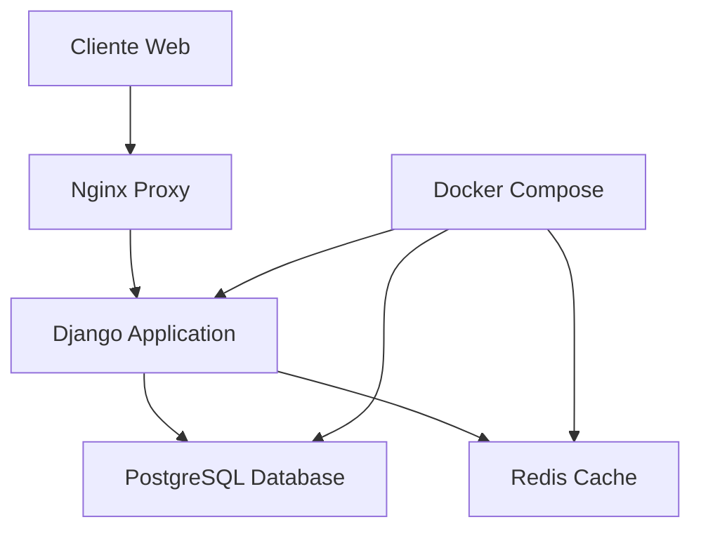

# 🛠️ Guía de Desarrollo y Despliegue

Esta guía completa está dirigida a desarrolladores que necesitan entender, modificar o desplegar el sistema Ecodisseny.

## 📋 Tabla de Contenidos

- [🏗️ Arquitectura del Sistema](#️-arquitectura-del-sistema)
- [🛠️ Tecnologías](#️-tecnologías)
- [⚡ Configuración de Desarrollo](#-configuración-de-desarrollo)
- [🐳 Desarrollo con Docker](#-desarrollo-con-docker)
- [🚀 Despliegue en VPS](#-despliegue-en-vps)
- [🔧 Configuración Avanzada](#-configuración-avanzada)
- [📂 Estructura del Proyecto](#-estructura-del-proyecto)
- [📖 API y Endpoints](#-api-y-endpoints)
- [🔍 Debugging y Troubleshooting](#-debugging-y-troubleshooting)

## 🏗️ Arquitectura del Sistema

### **Componentes Principales**



### **Aplicaciones Django**

- **`accounts`**: Gestión de usuarios y autenticación
- **`carregahores`**: Sistema de carga de horas
- **`maestros`**: Datos maestros (recursos, ubicaciones, tareas)
- **`projectes`**: Gestión de proyectos
- **`pressupostos`**: Sistema de presupuestos y cotizaciones
- **`documentacion`**: Sistema de documentación integrado

## 🛠️ Tecnologías

### **Backend**

```python
Django==5.2.4                 # Framework web principal
psycopg[binary]==3.2.1       # Conector PostgreSQL
django-jazzmin==3.0.0        # Admin interface moderna
django-autocomplete-light==3.11.0  # Autocompletado
WeasyPrint==62.3             # Generación de PDFs
django-bootstrap5==24.2      # Componentes Bootstrap
```

### **Base de Datos**

```
PostgreSQL 15                 # Base de datos principal
Redis (opcional)              # Cache y sesiones
```

### **Frontend**

```html
Bootstrap 5.3.3
<!-- Framework CSS -->
Font Awesome 6.0
<!-- Iconografía -->
jQuery 3.6.0
<!-- JavaScript utilities -->
```

### **Contenedores**

```dockerfile
Docker Engine 20.10+         # Containerización
Docker Compose 2.0+          # Orquestación
```

## ⚡ Configuración de Desarrollo

### **Requisitos Previos**

```bash
# Sistema operativo recomendado
Ubuntu 20.04+ / Debian 11+ / CentOS 8+

# Software requerido
Docker Engine 20.10+
Docker Compose 2.0+
Git 2.25+
```

### **Clonar el Repositorio**

```bash
# Clonar proyecto
git clone https://github.com/Mulastone/ecodisseny_dj_pg.git
cd ecodisseny_dj_pg

# Verificar branch
git branch -a
git checkout docker  # Si no estás ya en esta rama
```

### **Variables de Entorno**

```bash
# Crear archivo .env
cp .env.example .env

# Configurar variables básicas
cat > .env << EOF
DEBUG=True
SECRET_KEY=tu-clave-secreta-super-segura-para-desarrollo
DATABASE_URL=postgresql://postgres:postgres@db:5432/ecodisseny
ALLOWED_HOSTS=localhost,127.0.0.1
EOF
```

## 🐳 Desarrollo con Docker

### **Iniciar Entorno de Desarrollo**

```bash
# Construir contenedores
docker-compose build

# Iniciar servicios
docker-compose up -d

# Verificar estado
docker-compose ps

# Ver logs
docker-compose logs -f web
```

### **Configuración Inicial**

```bash
# Ejecutar migraciones
docker-compose exec web python manage.py migrate

# Crear superusuario
docker-compose exec web python manage.py createsuperuser

# Cargar datos de prueba (opcional)
docker-compose exec web python manage.py loaddata fixtures/demo_data.json

# Cargar documentación
docker-compose exec web python manage.py cargar_documentacion
```

### **Comandos de Desarrollo Útiles**

```bash
# Shell de Django
docker-compose exec web python manage.py shell

# Crear nuevas migraciones
docker-compose exec web python manage.py makemigrations

# Ejecutar tests
docker-compose exec web python manage.py test

# Recopilar archivos estáticos
docker-compose exec web python manage.py collectstatic --noinput

# Acceder al contenedor
docker-compose exec web bash

# Reiniciar servicios
docker-compose restart web
```

## 🚀 Despliegue en VPS

### **1. Preparación del Servidor**

#### **Actualizar Sistema**

```bash
# Ubuntu/Debian
sudo apt update && sudo apt upgrade -y

# Instalar dependencias básicas
sudo apt install -y curl wget git nano ufw fail2ban

# Configurar firewall
sudo ufw default deny incoming
sudo ufw default allow outgoing
sudo ufw allow ssh
sudo ufw allow 80
sudo ufw allow 443
sudo ufw --force enable
```

#### **Instalar Docker**

```bash
# Desinstalar versiones anteriores
sudo apt remove docker docker-engine docker.io containerd runc

# Instalar Docker oficial
curl -fsSL https://get.docker.com -o get-docker.sh
sudo sh get-docker.sh

# Añadir usuario al grupo docker
sudo usermod -aG docker $USER

# Instalar Docker Compose
sudo curl -L "https://github.com/docker/compose/releases/latest/download/docker-compose-$(uname -s)-$(uname -m)" -o /usr/local/bin/docker-compose
sudo chmod +x /usr/local/bin/docker-compose

# Verificar instalación
docker --version
docker-compose --version
```

### **2. Configuración del Proyecto**

#### **Clonar y Configurar**

```bash
# Crear directorio de aplicación
sudo mkdir -p /opt/ecodisseny
sudo chown $USER:$USER /opt/ecodisseny
cd /opt/ecodisseny

# Clonar repositorio
git clone https://github.com/Mulastone/ecodisseny_dj_pg.git .
git checkout docker

# Configurar permisos
sudo chown -R $USER:$USER /opt/ecodisseny
chmod +x deploy.sh setup_complete.sh
```

#### **Variables de Entorno de Producción**

```bash
# Crear archivo .env para producción
cat > .env << EOF
DEBUG=False
SECRET_KEY=$(python -c 'from django.core.management.utils import get_random_secret_key; print(get_random_secret_key())')
DATABASE_URL=postgresql://ecodisseny_user:$(openssl rand -base64 32)@db:5432/ecodisseny_prod
ALLOWED_HOSTS=tu-dominio.com,www.tu-dominio.com,tu-ip-del-servidor
CSRF_TRUSTED_ORIGINS=https://tu-dominio.com,https://www.tu-dominio.com

# Configuración de email (opcional)
EMAIL_HOST=smtp.gmail.com
EMAIL_PORT=587
EMAIL_USE_TLS=True
EMAIL_HOST_USER=tu-email@gmail.com
EMAIL_HOST_PASSWORD=tu-app-password

# Configuración de logs
LOG_LEVEL=WARNING
EOF

# Proteger archivo de configuración
chmod 600 .env
```

### **3. Configuración de Base de Datos**

#### **Docker Compose para Producción**

```yaml
# docker-compose.prod.yml
version: "3.8"

services:
  db:
    image: postgres:15
    restart: always
    environment:
      POSTGRES_DB: ecodisseny_prod
      POSTGRES_USER: ecodisseny_user
      POSTGRES_PASSWORD: ${DB_PASSWORD}
    volumes:
      - postgres_data:/var/lib/postgresql/data
      - ./init-db.sql:/docker-entrypoint-initdb.d/init-db.sql
    networks:
      - ecodisseny_network

  web:
    build: .
    restart: always
    depends_on:
      - db
    environment:
      - DATABASE_URL=postgresql://ecodisseny_user:${DB_PASSWORD}@db:5432/ecodisseny_prod
    volumes:
      - ./media:/app/media
      - ./static:/app/static
      - ./logs:/app/logs
    networks:
      - ecodisseny_network
    expose:
      - "8000"

  nginx:
    image: nginx:alpine
    restart: always
    depends_on:
      - web
    ports:
      - "80:80"
      - "443:443"
    volumes:
      - ./nginx/nginx.conf:/etc/nginx/nginx.conf
      - ./nginx/default.conf:/etc/nginx/conf.d/default.conf
      - ./static:/var/www/static
      - ./media:/var/www/media
      - ./ssl:/etc/nginx/ssl
    networks:
      - ecodisseny_network

volumes:
  postgres_data:

networks:
  ecodisseny_network:
    driver: bridge
```

### **4. Configuración de Nginx**

#### **Configuración Principal**

```nginx
# nginx/nginx.conf
user nginx;
worker_processes auto;
error_log /var/log/nginx/error.log;
pid /run/nginx.pid;

events {
    worker_connections 1024;
}

http {
    log_format main '$remote_addr - $remote_user [$time_local] "$request" '
                    '$status $body_bytes_sent "$http_referer" '
                    '"$http_user_agent" "$http_x_forwarded_for"';

    access_log /var/log/nginx/access.log main;

    sendfile on;
    tcp_nopush on;
    tcp_nodelay on;
    keepalive_timeout 65;
    types_hash_max_size 2048;
    client_max_body_size 100M;

    include /etc/nginx/mime.types;
    default_type application/octet-stream;

    # Gzip compression
    gzip on;
    gzip_vary on;
    gzip_min_length 10240;
    gzip_proxied expired no-cache no-store private must-revalidate auth;
    gzip_types
        text/plain
        text/css
        text/xml
        text/javascript
        application/x-javascript
        application/javascript
        application/xml+rss
        application/json;

    include /etc/nginx/conf.d/*.conf;
}
```

#### **Configuración del Sitio**

```nginx
# nginx/default.conf
upstream django {
    server web:8000;
}

# Redirect HTTP to HTTPS
server {
    listen 80;
    server_name tu-dominio.com www.tu-dominio.com;
    return 301 https://$server_name$request_uri;
}

# HTTPS server
server {
    listen 443 ssl http2;
    server_name tu-dominio.com www.tu-dominio.com;

    # SSL configuration
    ssl_certificate /etc/nginx/ssl/fullchain.pem;
    ssl_certificate_key /etc/nginx/ssl/privkey.pem;
    ssl_protocols TLSv1.2 TLSv1.3;
    ssl_ciphers ECDHE-RSA-AES256-GCM-SHA512:DHE-RSA-AES256-GCM-SHA512;
    ssl_prefer_server_ciphers off;
    ssl_session_cache shared:SSL:10m;
    ssl_session_timeout 10m;

    # Security headers
    add_header X-Frame-Options DENY;
    add_header X-Content-Type-Options nosniff;
    add_header X-XSS-Protection "1; mode=block";
    add_header Strict-Transport-Security "max-age=63072000; includeSubDomains; preload";

    # Static files
    location /static/ {
        alias /var/www/static/;
        expires 30d;
        add_header Cache-Control "public, immutable";
    }

    # Media files
    location /media/ {
        alias /var/www/media/;
        expires 7d;
    }

    # Django application
    location / {
        proxy_pass http://django;
        proxy_set_header Host $host;
        proxy_set_header X-Real-IP $remote_addr;
        proxy_set_header X-Forwarded-For $proxy_add_x_forwarded_for;
        proxy_set_header X-Forwarded-Proto $scheme;
        proxy_redirect off;

        # Increase timeout for large uploads
        proxy_connect_timeout 600s;
        proxy_send_timeout 600s;
        proxy_read_timeout 600s;
    }
}
```

### **5. Certificados SSL con Let's Encrypt**

```bash
# Instalar Certbot
sudo apt install snapd
sudo snap install core; sudo snap refresh core
sudo snap install --classic certbot

# Crear enlace simbólico
sudo ln -s /snap/bin/certbot /usr/bin/certbot

# Obtener certificado (método webroot)
sudo certbot certonly --webroot \
  -w /opt/ecodisseny/static \
  -d tu-dominio.com \
  -d www.tu-dominio.com

# Copiar certificados al directorio del proyecto
sudo mkdir -p /opt/ecodisseny/ssl
sudo cp /etc/letsencrypt/live/tu-dominio.com/fullchain.pem /opt/ecodisseny/ssl/
sudo cp /etc/letsencrypt/live/tu-dominio.com/privkey.pem /opt/ecodisseny/ssl/
sudo chown -R $USER:$USER /opt/ecodisseny/ssl

# Configurar renovación automática
echo "0 12 * * * /usr/bin/certbot renew --quiet && docker-compose -f /opt/ecodisseny/docker-compose.prod.yml restart nginx" | sudo crontab -
```

### **6. Script de Despliegue Automatizado**

```bash
#!/bin/bash
# deploy.sh - Script de despliegue completo

set -e

echo "🚀 Iniciando despliegue de Ecodisseny..."

# Variables
PROJECT_DIR="/opt/ecodisseny"
COMPOSE_FILE="docker-compose.prod.yml"
BACKUP_DIR="/backup/ecodisseny"

# Función de logging
log() {
    echo "$(date '+%Y-%m-%d %H:%M:%S') - $1"
}

# Crear backup antes del despliegue
log "📦 Creando backup de base de datos..."
mkdir -p $BACKUP_DIR
docker-compose -f $COMPOSE_FILE exec -T db pg_dump -U ecodisseny_user ecodisseny_prod | gzip > $BACKUP_DIR/backup_$(date +%Y%m%d_%H%M%S).sql.gz

# Detener servicios
log "🛑 Deteniendo servicios..."
docker-compose -f $COMPOSE_FILE down

# Actualizar código
log "📥 Actualizando código..."
git pull origin docker

# Construir nuevas imágenes
log "🔨 Construyendo contenedores..."
docker-compose -f $COMPOSE_FILE build --no-cache

# Ejecutar migraciones
log "🗄️ Ejecutando migraciones..."
docker-compose -f $COMPOSE_FILE run --rm web python manage.py migrate

# Recopilar archivos estáticos
log "📁 Recopilando archivos estáticos..."
docker-compose -f $COMPOSE_FILE run --rm web python manage.py collectstatic --noinput

# Cargar documentación actualizada
log "📚 Actualizando documentación..."
docker-compose -f $COMPOSE_FILE run --rm web python manage.py cargar_documentacion --update

# Iniciar servicios
log "🚀 Iniciando servicios..."
docker-compose -f $COMPOSE_FILE up -d

# Verificar salud del sistema
log "🔍 Verificando servicios..."
sleep 10
if curl -f http://localhost/admin/ > /dev/null 2>&1; then
    log "✅ Despliegue completado exitosamente"
else
    log "❌ Error en el despliegue - verificar logs"
    docker-compose -f $COMPOSE_FILE logs
    exit 1
fi

log "🎉 ¡Ecodisseny desplegado correctamente!"
```

### **7. Configuración de Monitoreo**

#### **Script de Verificación de Salud**

```bash
#!/bin/bash
# health_check.sh

# Verificar servicios Docker
if ! docker-compose -f /opt/ecodisseny/docker-compose.prod.yml ps | grep -q "Up"; then
    echo "❌ Servicios Docker no están funcionando"
    exit 1
fi

# Verificar respuesta web
if ! curl -f -s http://localhost/admin/ > /dev/null; then
    echo "❌ Aplicación web no responde"
    exit 1
fi

# Verificar base de datos
if ! docker-compose -f /opt/ecodisseny/docker-compose.prod.yml exec -T db pg_isready -U ecodisseny_user > /dev/null; then
    echo "❌ Base de datos no disponible"
    exit 1
fi

echo "✅ Sistema funcionando correctamente"
```

#### **Configurar Cron para Monitoreo**

```bash
# Editar crontab
crontab -e

# Añadir tareas de monitoreo
# Verificación cada 5 minutos
*/5 * * * * /opt/ecodisseny/health_check.sh >> /var/log/ecodisseny_health.log 2>&1

# Backup diario a las 2 AM
0 2 * * * /opt/ecodisseny/backup.sh >> /var/log/ecodisseny_backup.log 2>&1

# Limpiar logs antiguos semanalmente
0 0 * * 0 find /var/log -name "*ecodisseny*" -mtime +30 -delete
```

## 🔧 Configuración Avanzada

### **Optimización de PostgreSQL**

```sql
-- postgresql.conf optimizations
# Memory settings
shared_buffers = 256MB
effective_cache_size = 1GB
work_mem = 4MB
maintenance_work_mem = 64MB

# Connection settings
max_connections = 100
shared_preload_libraries = 'pg_stat_statements'

# Logging
log_statement = 'mod'
log_min_duration_statement = 1000
```

### **Variables de Entorno Avanzadas**

```bash
# .env para producción avanzada
# Configuración de cache
CACHE_URL=redis://redis:6379/1

# Configuración de sesiones
SESSION_COOKIE_SECURE=True
SESSION_COOKIE_HTTPONLY=True
SESSION_COOKIE_AGE=3600

# Configuración de seguridad
SECURE_SSL_REDIRECT=True
SECURE_HSTS_SECONDS=31536000
SECURE_CONTENT_TYPE_NOSNIFF=True
SECURE_BROWSER_XSS_FILTER=True

# Configuración de logging
LOGGING_LEVEL=INFO
SENTRY_DSN=tu-sentry-dsn-aqui
```

## 📂 Estructura del Proyecto

```
ecodisseny_dj_pg/
├── 📁 accounts/                 # Gestión de usuarios
├── 📁 carregahores/            # Sistema de carga de horas
├── 📁 documentacion/           # Sistema de documentación
├── 📁 ecodisseny/              # Configuración principal
├── 📁 maestros/                # Datos maestros
├── 📁 pressupostos/            # Sistema de presupuestos
├── 📁 projectes/               # Gestión de proyectos
├── 📁 static/                  # Archivos estáticos
├── 📁 templates/               # Plantillas HTML
├── 📁 media/                   # Archivos multimedia
├── 📁 nginx/                   # Configuración Nginx
├── 📁 docs/                    # Documentación
├── 🐳 docker-compose.yml       # Desarrollo
├── 🐳 docker-compose.prod.yml  # Producción
├── 🐳 Dockerfile              # Imagen de la aplicación
├── 📋 requirements.txt         # Dependencias Python
├── ⚙️ manage.py               # CLI de Django
└── 🚀 deploy.sh               # Script de despliegue
```

### **Aplicaciones Principales**

#### **Accounts** - Sistema de Usuarios

```python
# models.py principales
User (Django built-in)
UserProfile               # Perfil extendido de usuario
```

#### **Maestros** - Datos Base

```python
Ubicacion                 # Ubicaciones de trabajo
Recurs                    # Recursos (personal/material)
TipusRecurs              # Tipos de recursos
Tasca                    # Tareas del sistema
```

#### **Projectes** - Gestión de Proyectos

```python
Projecte                 # Proyecto principal
ProjecteRecurs           # Recursos asignados
EstatsProjecte           # Estados del proyecto
```

#### **Pressupostos** - Sistema de Presupuestos

```python
Pressupost              # Presupuesto principal
PressupostLinia         # Líneas de presupuesto
PressupostRecurs        # Recursos del presupuesto
```

#### **Carregahores** - Carga de Horas

```python
RegistreHores           # Registro de horas trabajadas
```

## 📖 API y Endpoints

### **URLs Principales**

```python
# ecodisseny/urls.py
urlpatterns = [
    path('admin/', admin.site.urls),
    path('', include('accounts.urls')),
    path('projectes/', include('projectes.urls')),
    path('pressupostos/', include('pressupostos.urls')),
    path('carregahores/', include('carregahores.urls')),
    path('maestros/', include('maestros.urls')),
    path('documentacion/', include('documentacion.urls')),
]
```

### **API Endpoints Personalizados**

```python
# Autocomplete endpoints
path('maestros/ubicacion-autocomplete/',
     UbicacionAutocomplete.as_view(),
     name='ubicacion-autocomplete'),

path('maestros/recurs-autocomplete/',
     RecursAutocomplete.as_view(),
     name='recurs-autocomplete'),

# PDF generation
path('pressupostos/<int:pk>/pdf/',
     PressupostPDFView.as_view(),
     name='pressupost-pdf'),
```

### **Vistas Importantes**

```python
# Vistas de Dashboard
class DashboardView(LoginRequiredMixin, TemplateView)
class ProjecteDashboardView(LoginRequiredMixin, DetailView)
class PressupostDashboardView(LoginRequiredMixin, DetailView)

# Vistas de CRUD
class ProjecteCreateView(LoginRequiredMixin, CreateView)
class PressupostCreateView(LoginRequiredMixin, CreateView)

# Vistas de API
class ProjecteAutocomplete(LoginRequiredMixin, autocomplete.Select2QuerySetView)
```

## 🔍 Debugging y Troubleshooting

### **Logs Importantes**

```bash
# Ver logs de la aplicación
docker-compose logs -f web

# Ver logs de base de datos
docker-compose logs -f db

# Ver logs de Nginx
docker-compose logs -f nginx

# Ver logs del sistema
tail -f /var/log/syslog
```

### **Comandos de Diagnóstico**

```bash
# Verificar estado de contenedores
docker-compose ps

# Verificar uso de recursos
docker stats

# Acceso directo a la base de datos
docker-compose exec db psql -U ecodisseny_user ecodisseny_prod

# Verificar conectividad
curl -I http://localhost/admin/

# Verificar certificados SSL
openssl x509 -in /opt/ecodisseny/ssl/fullchain.pem -text -noout
```

### **Problemas Comunes**

#### **Contenedores no inician**

```bash
# Verificar logs
docker-compose logs

# Reconstruir desde cero
docker-compose down -v
docker-compose build --no-cache
docker-compose up -d
```

#### **Error de permisos**

```bash
# Corregir permisos
sudo chown -R $USER:$USER /opt/ecodisseny
chmod -R 755 /opt/ecodisseny
```

#### **Base de datos corrupta**

```bash
# Restaurar desde backup
gunzip -c backup_20240815.sql.gz | docker-compose exec -T db psql -U ecodisseny_user ecodisseny_prod
```

#### **Problemas de SSL**

```bash
# Renovar certificados
sudo certbot renew --force-renewal
sudo cp /etc/letsencrypt/live/tu-dominio.com/*.pem /opt/ecodisseny/ssl/
docker-compose restart nginx
```

## 🤝 Contribución al Desarrollo

### **Flujo de Trabajo**

```bash
# 1. Crear rama para nueva feature
git checkout -b feature/nueva-funcionalidad

# 2. Desarrollar y hacer commits
git add .
git commit -m "feat: agregar nueva funcionalidad"

# 3. Push y crear Pull Request
git push origin feature/nueva-funcionalidad

# 4. Revisar y mergear
git checkout docker
git merge feature/nueva-funcionalidad
```

### **Estándares de Código**

```python
# Usar Black para formateo
pip install black
black .

# Usar flake8 para linting
pip install flake8
flake8 .

# Usar isort para imports
pip install isort
isort .
```

### **Testing**

```bash
# Ejecutar tests
docker-compose exec web python manage.py test

# Con coverage
docker-compose exec web coverage run manage.py test
docker-compose exec web coverage report
```

---

## 📚 Referencias y Recursos

- [Django Documentation](https://docs.djangoproject.com/)
- [Docker Compose Documentation](https://docs.docker.com/compose/)
- [PostgreSQL Documentation](https://www.postgresql.org/docs/)
- [Nginx Documentation](https://nginx.org/en/docs/)
- [Let's Encrypt Documentation](https://letsencrypt.org/docs/)

---

_💡 **Tip**: Mantén siempre backups actualizados y prueba el proceso de restauración regularmente._
