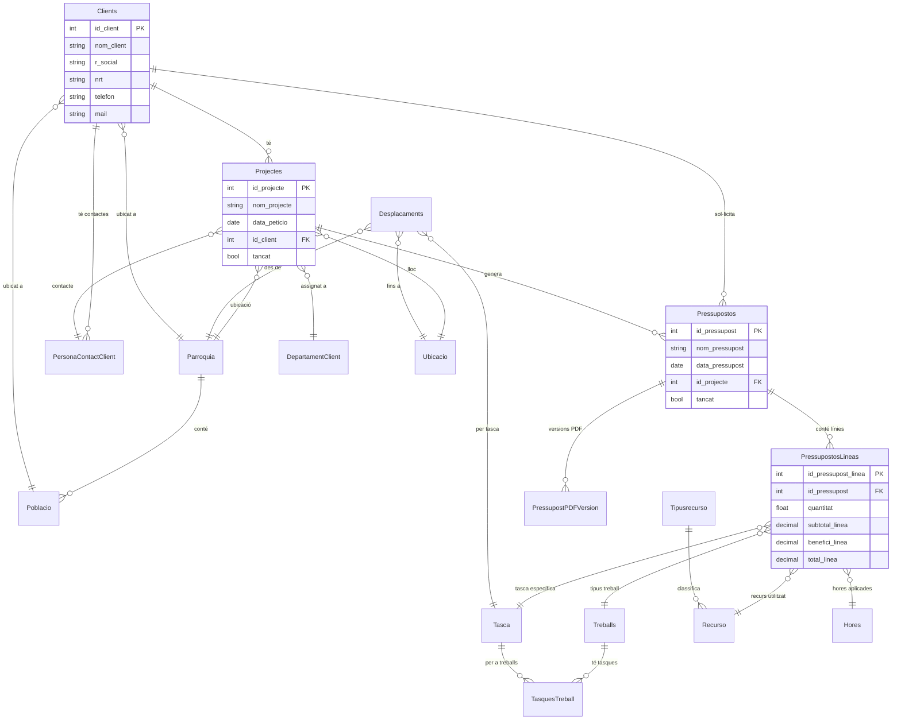
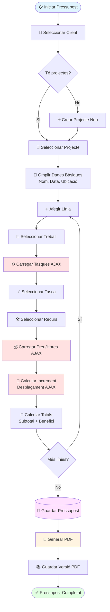
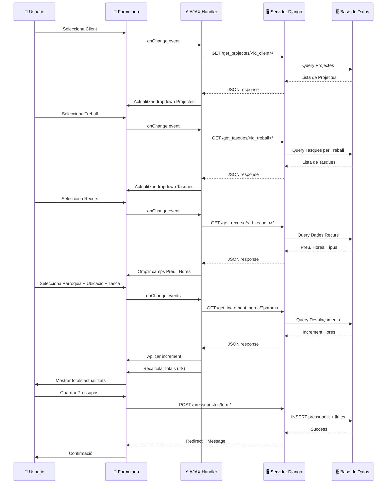
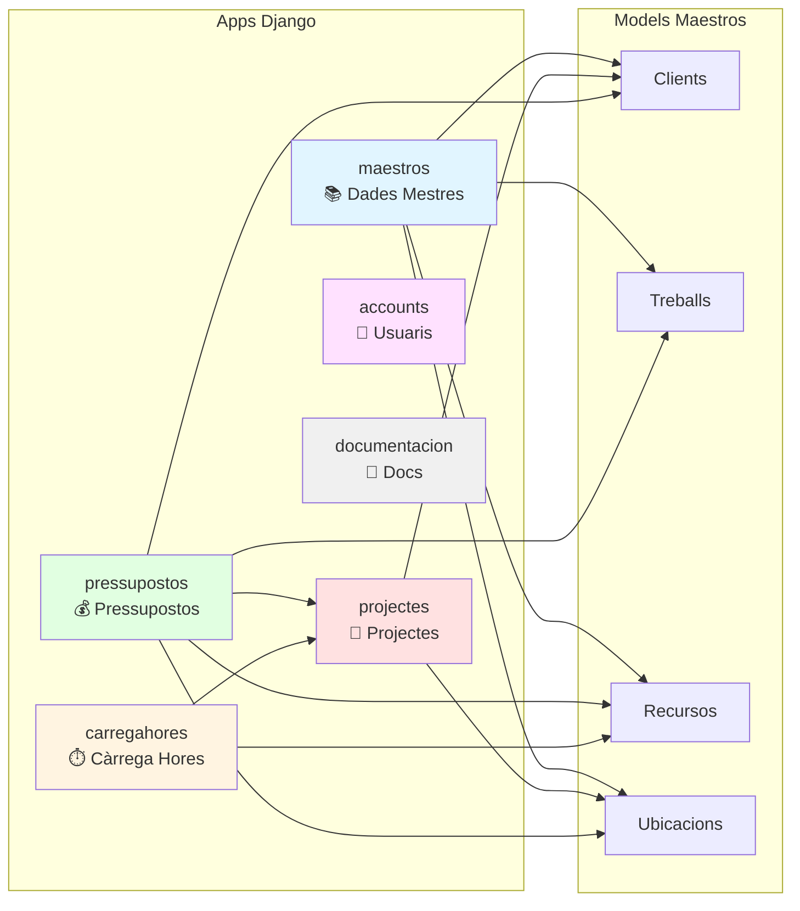

## 📄 Esquema de Models i Rutes - Ecodisseny

---

### 🔄 Models (texto pla)

#### `maestros`

```text
Clients
├─ id_client (PK)
├─ nom_client
├─ r_social, nrt, telefon, mail
├─ parroquia (FK → Parroquia)
└─ poblacio (FK → Poblacio)

Parroquia
└─ id_parroquia, parroquia

Poblacio
├─ id_poblacio, poblacio, codi_postal
└─ id_parroquia (FK)

DepartamentClient
└─ id_departament, nom

PersonaContactClient
├─ id_persona_contact
├─ nom_contacte, telefon, mail
└─ id_client (FK)

Treballs
└─ id_treball, descripcio

Tasca
└─ id_tasca, tasca

TasquesTreball
├─ id_tasca (FK)
└─ id_treball (FK)

Tipusrecurso
└─ id_tipus_recurso, tipus

Recurso
├─ id_recurso, name
├─ preu_tancat (bool), preu_hora
└─ id_tipus_recurso (FK)

Ubicacio
└─ id_ubicacio, ubicacio

Hores
└─ id_hora, hores

Desplacaments
├─ id_parroquia, id_ubicacio, id_tasca (FKs)
└─ increment_hores
```

#### `projectes`

```text
Projectes
├─ id_projecte (PK)
├─ nom_projecte, data_peticio
├─ id_client (FK)
├─ id_departament, id_persona_contact (FK)
├─ id_parroquia, id_ubicacio (FK)
└─ observacions, tancat (bool)
```

#### `pressupostos`

```text
Pressupostos
├─ id_pressupost (PK)
├─ nom_pressupost, data_pressupost
├─ id_client, id_projecte, id_parroquia, id_ubicacio (FKs)
├─ observacions
└─ tancat (bool)

PressupostosLineas
├─ id_pressupost_linea (PK)
├─ id_pressupost (FK)
├─ id_treball, id_tasca, id_recurso, id_hora (FKs)
├─ quantitat, preu_tancat (bool)
├─ cost_tancat, increment_hores, hores_totals
├─ cost_hores, cost_hores_totals
├─ subtotal_linea, benefici_linea, total_linea

PressupostPDFVersion
├─ pressupost (FK → Pressupostos)
├─ version (int), arxiu (PDF file)
├─ generat_per (User FK), data_generat (auto)
```

---

### 🌐 Rutes Principals

#### `/pressupostos/`

| Ruta                 | Vista                   | Descripció                  |
| -------------------- | ----------------------- | --------------------------- |
| `/`                  | `list_pressuposts`      | Llista de pressupostos      |
| `/form/`             | `form_pressupost`       | Crear pressupost            |
| `/form/<id>/`        | `form_pressupost`       | Editar pressupost           |
| `/delete/<id>/`      | `delete_pressupost`     | Eliminar pressupost         |
| `/pdf/<id>/`         | `ver_pdf_pressupost`    | PDF inline                  |
| `/<id>/generar_pdf/` | `generar_pdf_y_guardar` | Generar nova versió PDF     |
| `/detall/<id>/`      | `detail_view`           | Històric de versions de PDF |

#### AJAX endpoints

| Ruta                              | Funció JS associada               |
| --------------------------------- | --------------------------------- |
| `/get_projectes/<id_client>/`     | Canvi client → projectes          |
| `/get_tasques/<id_treball>/`      | Canvi treball → tasques           |
| `/get_recurso/<id_recurso>/`      | Canvi recurs → config. hores/preu |
| `/get_increment_hores/?params...` | Canvi parroquia+ubicació+tasca    |

---

## 📊 Diagramas del Sistema

### 🗄️ Diagrama de Relaciones de Base de Datos



### 🔄 Flujo de Creación de Presupuesto



### 🔌 Secuencia de Interacciones AJAX



### 📦 Módulos y Dependencias



---
